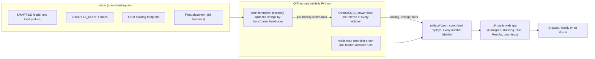

# Batter Up

<p align="center"></p>

*Formerly "Hugging Base"; the repository keeps its original name.*

**Feeder-aware charging for a fleet of home batteries.** Base Power × AITX hackathon, Sep 2026.

**Live demo: https://batter-up-grid.vercel.app** (opens the story app; also at https://hugging-base.vercel.app). No install, no sign-in: static files on Vercel.

## The problem

When the ERCOT price crashes in the evening, a fleet of home batteries that all start charging at once can overload the street transformers that feed those homes, even while the wider grid is fine. ERCOT dispatch sees the price zone, not the neighbourhood: the feeder and the service transformer on the pole. Batter Up checks each transformer's room before it sends a charge command, and shows on a feeder model refereed by OpenDSS that the fleet still charges, with no overload caused by batteries.

## The four pages

Pick a scenario on page 1; the same scenario carries through every page. Every scenario is a run the engine already made and committed.

| Page | What it answers |
|---|---|
| **Configure** | Which evening, which charging policy (no batteries, naive, feeder-aware), which failure (none, pieces fail, controller crash, hidden attacker), and which fleet settings? |
| **Running** (between Configure and Run) | Which files does this run play, and what did the engine measure it cost to make? No fake progress bar: the run already happened. |
| **Run** | What happens on the street, minute by minute from 16:00 to 04:00, in 3D? |
| **Results** | Did any transformer break its rating, how low did home voltage go, and was the fleet charged by 04:00, compared with every other run? |
| **Learnings** | How many batteries fit, what happens to one transformer as batteries are added, which transformers to upgrade as home load grows, and where the next battery helps most? |

## What is real and what is simulated

- **Every number is labelled** REAL, SIM, DERIVED or ASSUMPTION, and comes from a committed file the engine wrote. Hover or tap a tag for its source. The audited numbers, each with its file and field: [docs/NUMBERS.md](docs/NUMBERS.md).
- **OpenDSS is the referee.** An AC power flow judges every violation in the evening runs. Month and growth counts from the faster per-transformer estimate are marked SCREENING.
- **The feeder** is NREL's SMART-DS Austin P1U, a synthetic feeder ("realistic but not real"), used as an **Oncor-suburb stand-in** settled at ERCOT's LZ_NORTH zone. ERCOT prices are REAL.
- **The attacker is fictional.** No real company or person is named as an attacker.
- **Money is gross energy value**, not Base's profit.
- **No language model sets any number.** Deterministic code decides every charge command, base point and rank.
- "Naive" charging is our assumption of a simple rule (everyone at once, no feeder check). It is not how Base charges; Base's method is not public.

## Run it locally

```sh
scripts/serve.sh      # a static file server from the repo root on port 8765 (needs only python3)
```

Open **http://127.0.0.1:8765/ui/index.html**. The app is static: the browser only reads committed JSON, with no server logic and no network calls at view time.

For the engine and the tests:

```sh
scripts/setup.sh      # once: checks or creates the Python venv; ends "SETUP: OK"
scripts/check_all.sh  # the full gate: unit, node, archived-prototype, contract, verify and browser smoke tests; ends "ALL CHECKS: PASS"
```

More detail, including every page link and how to read the screen: [docs/run-the-demo.md](docs/run-the-demo.md).

## Reproduce the demo: environment variables and keys

**None are required.** The demo needs no API key, no account, no `.env` file and no network: it replays committed JSON under `ui/data/`. The two commands above are the whole reproduction; the video's beats are one link each in [docs/demo-script.md](docs/demo-script.md).

Requirements: `python3` to view the demo; Python 3.12 or newer, Node 22 or newer and Chrome to rebuild the numbers and run the tests.

To regenerate the numbers from the inputs (slow: OpenDSS solves every minute of every evening):

```sh
scripts/setup.sh
scripts/build_all.sh all       # topology, fixtures, p1, p2, referee; ends "BUILD: PASS"
scripts/check_all.sh --full    # rebuilds every artifact and byte-compares it with the committed copy
```

Optional overrides, all with working defaults, are listed in [.env.example](.env.example). The scripts do not read a `.env` file; export a variable in your shell if you need one.

| Variable | Default | What it changes |
|---|---|---|
| `PORT` | `8765` | The port `scripts/serve.sh` listens on. |
| `HB_VENV` | `~/hb-overnight/.venv` | Where `scripts/setup.sh` creates or finds the Python venv. |
| `PY` | the venv's Python | The interpreter the build and test scripts use. |
| `CHROME` | found automatically | The Chrome binary for the browser smoke test. |
| `HB_SLOW` | unset | `1` also runs the slow full-evening engine tests. |
| `HB_LOCK_HELD` | unset | `1` skips the heavy-run lock (needed on Windows and Linux without `lockf`). |
| `PLAN_WORKERS` | `1` | Parallel workers for the capacity planner build. |

## Tech stack and architecture

| Layer | What we used |
|---|---|
| Power flow (the referee) | OpenDSS through OpenDSSDirect.py 0.9.4 |
| Engine | Python 3.12+, numpy 2.5.3; no other dependency |
| Resilience | Python: controller workers with leases, a peer detector for the hidden attacker |
| Web app | Plain JavaScript modules, HTML and CSS, no framework and no build step; deck.gl 9.4.0 (vendored) for the 3D street |
| Tests | Python `unittest`, `node --test`, a headless-Chrome smoke test |
| Hosting | Vercel, static files only |



The arrow from the engine to the app is a file, not a service: the engine runs ahead of time and commits its output, and the browser only reads it. The controller acts on its own view of transformer load; OpenDSS scores every step afterwards and never controls. No language model is anywhere in this path.

## Where everything lives

| Folder or file | What it is |
|---|---|
| `README.md` | This page. |
| [`docs/`](docs/README.md) | Everything a judge needs: how to run the demo, the video script, the audited numbers, data sources and licences, research, and the data contracts. Start at [docs/README.md](docs/README.md). |
| `ui/` | The web app (the four pages). This is what the live demo serves. |
| `video/` | The Batter Up intro video (`batterup-intro-video.mp4`) and its source. |
| `vercel.json`, `.vercelignore` | Hosting: Vercel serves only `ui/` (the site root opens the story app). |
| `sim/` | The engine: the Python simulator that wrote every number the app shows, with OpenDSS as the referee. |
| `resilience/` | Controller-crash survival (a worker is killed and another takes over), the hidden-attacker detector, and physics checks. |
| `data/` | Pre-extracted inputs (the SMART-DS feeder, load profiles, ERCOT prices, building footprints, the fleet placement, the capacity planner's inputs), with a `SOURCE.md` for each source. |
| `scripts/` | Setup, the local server, the engine builds and the test gate. |
| `requirements.txt` | Python dependencies for the engine and tests. |
| `CLAUDE.md`, `.claude/` | Instructions for AI coding assistants working in this repo. |
| `.gitignore`, `.gitattributes` | Git settings. |
| [`previous-work/`](previous-work/README.md) | **The archive. Not part of the submission.** Earlier prototypes, personal simulators, design history and hand-off notes, moved here on 27 Sep 2026 so nothing was deleted. |

## Key documents

- [docs/README.md](docs/README.md): the index of every judge document.
- [docs/demo-script.md](docs/demo-script.md): the five-minute video, beat by beat, one link per beat.
- [docs/NUMBERS.md](docs/NUMBERS.md): every number the video says, with its label, file and field.
- [docs/data-sources.md](docs/data-sources.md): where each input comes from, its licence and its label.

## Team

Connor Daly - Product Design and System Design - connor@nanama.io
Razaq Alagbada - Data and System Design - razaqalagbada@gmail.com
Michael Palacios - Data and Electrical Consulting - michaelxpalacios@gmail.com
Bo Banducci - Video Production - bobanducci90@gmail.com
Ashley I. - Presentation Production

## Data and licences

- **SMART-DS** (NREL's synthetic feeder and load profiles): CC BY 4.0.
- **OpenStreetMap** building footprints: ODbL.
- **ERCOT** market data: public ERCOT data, used in analysis (not ERCOT's logo).
- **deck.gl** (vendored in `ui/vendor/`): MIT.

**Synthetic and assumed data.** The feeder is synthetic (NREL calls SMART-DS "realistic but not real"), not a utility circuit. The 96-battery fleet placement is ours (ASSUMPTION): a deliberate stress placement, 24 batteries clustered on the densest homes plus 72 random homes, seed 17263. The failure scenarios (pieces fail, controller crash, hidden attacker) are scripted by us, and the attacker is fictional. The one recorded ERCOT frequency day (25 Sep 2026) is REAL.

Details, file paths, checksums and attribution for every input: [docs/data-sources.md](docs/data-sources.md).

## Known limitations

- **One synthetic feeder.** Every result is for one SMART-DS feeder (1,010 customers, 379 transformers) used as an Oncor-suburb stand-in. Its coordinates fall in Pedernales Electric Cooperative territory, and LZ_NORTH is a placeholder zone. Nothing here is measured on a real circuit.
- **2018 load, 2026 prices.** Load profiles from the 2018 weather year are paired with 2026 prices by calendar date, which mixes weekdays and weekends. If the profiles are in standard time, every August load sits one hour early against the prices; the +1 h sensitivity run has not been done.
- **The controller sees more than Base does today.** It assumes total transformer load with a 60-second lag. Base sees its members' meters; off a street where every home is a member, that needs a utility meter-to-transformer map.
- **Battery constants are assumptions.** Usable energy (37 kWh), round-trip efficiency (0.89) and unity power factor are unpublished values we chose.
- **The fuse rule is an assumption, and a knife edge.** On 23 Aug the naive run stays above 200% for 9 minutes, one short of the rule.
- **"Naive" is our assumption,** not how Base charges. Base's method is not public.
- **Voltage is not in the capacity test.** In the 1,007-battery feeder-aware build one home dips just under the 0.95 pu floor (0.9498 pu).
- **Money is gross energy value with perfect price foresight,** not Base's profit. Local transformer relief is unpriced: we found no ERCOT programme that pays for it.
- **Coverage.** Four evenings are simulated in full; the failure scenarios exist for 23 Aug with feeder-aware charging only. Month and growth counts use the faster per-transformer estimate and are marked SCREENING.
- **Replay, not live.** The app plays committed runs; it does not take a new scenario and solve it in the browser.

## Next steps

- Replace the assumptions with Base's answers: the ten open questions in [docs/how-base-plugs-in.md](docs/how-base-plugs-in.md) each change a labelled constant, not the code.
- Run on a real feeder with the utility's transformer ratings and meter-to-transformer map.
- Run the +1 h clock sensitivity and pair load and prices from the same weather year.
- Add voltage to the capacity test, and test volt-VAR as well as unity power factor.
- Extend the failure scenarios to the other evenings and to the naive policy.
- Source transformer replacement cost and failure data, to turn avoided overload minutes into dollars.

## Hosting

The live demo is the static `ui/` folder on Vercel (config: `vercel.json`, `.vercelignore`). No server, no database: every number is committed JSON the engine wrote. To redeploy from the repo root: `vercel deploy --prod`, then `vercel alias set <deployment-url> batter-up-grid.vercel.app`.
