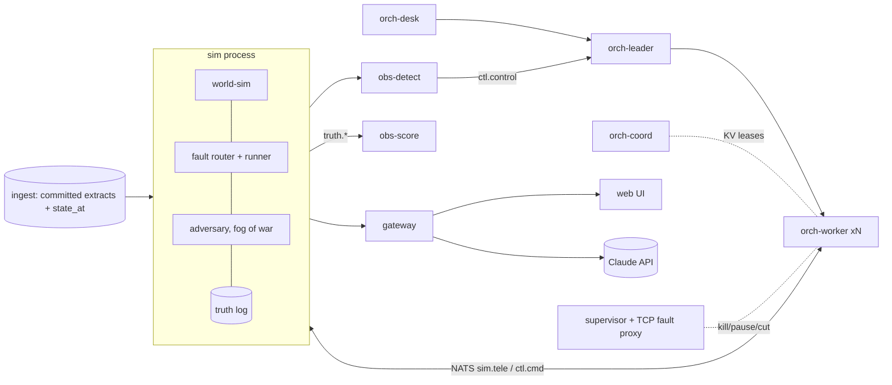

# Headroom: product requirements document (v1)

**Working name:** Headroom, a feeder-aware orchestrator and what-if lab for a fleet of Base home batteries.

**Status:** v1, 2026-09-25. Merged from five round-1 proposals and two critiques. Build from this document. Event rules, the team and the rubric are in `CONTEXT.md`. Staffing, schedule and cuts are the team's call. This PRD defines the contracts, a minimal spine, and layers tagged ESSENTIAL or ENHANCEMENT with their dependencies.

**Citations**
- **[R: section]** `reports/Base Power system and ERCOT data.md`.
- **Research notes** in `research_notes/Base Power system and ERCOT data/`:
  - [P §n] `base_power_product_and_system.md`
  - [B §n] `base_power_company_business.md`
  - [E §n] `ercot_public_data_apis.md`
  - [G §n] `grid_physics_orchestration_and_attacks.md`
  - [D §n] `simulator_public_datasets_and_tools.md`
- **Round-1 docs** in `design/round1/`:
  - WS `world-sim.md`, OR `orchestrator.md`, AO `adversary-and-observability.md`, DI `data-ingest.md`, UI `ui-scenario-studio.md`
  - CJ `critique-judge.md`, CI `critique-integration.md`
- **Evidence paths** are repo-relative. `evidence/scratchpad-20260925/` replaces every `/private/tmp/...` path cited in round 1.

**Tags**
- **SOURCED:** cited fact.
- **DERIVED:** computed; the method is given.
- **ASSUMPTION:** our choice, and a config knob.
- **UNVERIFIED:** carried from the research.

**Binding conventions**
- **Sign:** battery `p_kw > 0` means discharge/export. Home load `> 0` means consumption. `p_site_kw = p_home − p_batt`, where `> 0` means import.
- **Units:** named in the field. kW for devices, transformers and feeders. MW for partitions, the system and the market.
- **Time:** `t_ms` is int64 UTC ms in sim time, labelled by interval start.

---

## 1. Summary

We are building an orchestration system for a fleet of Base batteries.
- **Inputs:** real ERCOT prices and NREL's synthetic north-Austin feeders.
- **world-sim:** every battery is its own device, with firmware rules, a radio link, a home and a service transformer.
- **Orchestrator:** a set of real OS processes on a real message bus. It splits the Markets desk's 5-minute base point across the fleet.
- **Test harness:** kills those processes, cuts their network and steals their keys.
- **Detectors:** physics-based. They find what went wrong, scored against ground truth they never see.

**The single insight it proves:** ERCOT dispatches the fleet as one number per load zone and declines in writing to enforce distribution limits, **so what the fleet can reliably deliver is decided at the feeder.**
- A controller that knows transformer and feeder headroom, and that fences its own failures at the battery, keeps its commitments.
- A load-zone controller keeps them only by overloading transformers.

**We measure:**
- how many batteries a real-looking feeder hosts under each controller;
- what feeder awareness costs in MW and dollars;
- how much harm a failure or an attacker does before it is caught.

---

## 2. Problem and why

**The gap.** Base bids each load-zone partition into SCED as one ADER, which ERCOT dispatches "using Load Zone shift factors". The ADER governing document says distribution limits "will not explicitly be enforced by ERCOT's systems in awarding or dispatching the ADER" [R: How Base's fleet plugs in].

Base's hardware sharpens this gap:
- A 20 kW Core charging at full power is about 80% of a 25 kVA transformer [R: Each additional battery].
- Base's Houston partition swung its charging from −15.9 to −45.8 MW in 10–15 minutes [P §5].
- Homebuilder deals put a battery in nearly every home on a feeder [R: A power company…].

Base's deployment engineer asked exactly this: how each extra battery affects a stressed feeder, and how the fleet would behave if the controller knew feeder capacity [CONTEXT].

**Orchestration (primary track).** The track asks us to "coordinate many independent things … how it holds up when pieces fail".
- **The independent things:** batteries, controller processes, and several principals: the Markets desk, utility programs, and each member's 20% backup floor [R: Four utilities also hold the joystick].
- **Pieces that fail physically:** links, feeders, lying devices.
- **Pieces of ours that fail:** workers, leaders, the bus.
- **Base is hiring for this:** its postings ask for "controls for … concentrations of aggregated battery deployments at distribution system voltages" and "automated fault detection, isolation, and recovery" [R: Each battery is a 20 kW grid asset].

**Open Grid Data (second track).** The simulator runs on ERCOT's own files: 15-minute settlement point prices, the frequency-event workbook (NP12-261-M) and the ADER workbooks. It yields two findings most readers miss (§9.5).

**What Base lacks.** Base does grid-load estimation math, but not in a way that teaches its software to act better. It has no outage simulator, and wants "a place to play the what-ifs" [CONTEXT]. Headroom is that place. Its dispatch policy is a pluggable function, so Base's black-box ML can be tested on the same scenarios.

---

## 3. Goals, non-goals, and claims

**Goals**
- **G1.** Run the core loop on video without crashing: data → sim → orchestrator → failure or attack → detection → mitigation → score → UI → recorded run.
- **G2.** Show headline hosting curves (naive / naive+jitter / feeder-aware), with tiered, battery-attributable violations and the MW and $ given up.
- **G3.** Show real control-plane failures with measured handoff times and invariants enforced at the device.
- **G4.** Contain a hijack using device-enforced bounds plus a command audit.
- **G5.** Present two Track 1 findings with their caveats.
- **G6.** Make every on-screen number traceable to a source, a derivation or a labelled assumption.

**Non-goals**
- Predicting Base's bids or cloning its ML.
- Backup-only outage stories. The engineer called them "not too interesting".
- Fleet frequency regulation or FFR as a product. ADER offers no Regulation, PFR is optional and RRS is under study [P §5], so fleet frequency response is off by default and exists as a what-if.
- Real exploit code or real vendor names (AO §2 N6).
- Any scale figure that was not run and measured.

| # | Claim (video wording) | Status | Evidence |
|---|---|---|---|
| C1 | ERCOT sees this fleet as one number per load zone and does not enforce distribution limits. | Holds | ADER Governing Doc 3.3 [R]. Say that the utility screens homes at registration. |
| C2 | One Core is about 80% of a 25 kVA transformer. With a Core, 25 kVA units exceed their 110% normal rating on summer evenings. | Holds with caveat. Framing, not discovery (CJ §3). | 2.67 homes × 4–6 kW + 20 kW gives 123–144%, below the 150% emergency rating (CJ §2.3). The 4–6 kW is UNVERIFIED [G §2] until test R3. SMART-DS may understate stress (§6.1). |
| C3 | Naive dispatch creates its first battery-attributable normal-tier violation at N ≈ 1–2 devices. Feeder-aware dispatch holds zero normal- or emergency-tier violations up to N = [measured], giving up [measured] MW and $[measured]. | Holds with caveat. The arithmetic is verified. The curve values come from the harness and are not yet measured. | §9.1. Bucket model first, OpenDSS later (L-01). The feeder is synthetic and labelled so. |
| C4 | Random start delay fixes the charging spike, not the plateau. | Holds, but close to a tautology. Show it as a chart, not a finding. | NAIVE+JITTER arm, §9.1. |
| C5 | A hijacked shard is a neighbourhood emergency but invisible statewide. 1,000 Cores swing 40 MW (33 MW at a 60/40 Core/legacy mix). That moves frequency about 3–17 mHz depending on the model: no larger than normal wander (σ 13.7 mHz on 2026-09-25) and 150 mHz from the FFR trigger. | Holds with caveat. Always a band, never a point value. | CJ §2.1. `evidence/critique-scratch/freq_noise.py`, `fme_sensitivity.py`. The spine's one-shard swing (≈3.0 MW) gives ≈0.2–1.7 mHz. |
| C6 | With a device-enforced delay, about 1.5% of a hijack's swing lands before a 1 s audit plus revocation (0.6 of 40 MW). If the command could set the delay, about 79% would land. A backdoor off the cloud path lands 13–17%. | Holds with caveat. The three conditions in §9.3 apply. | Monte Carlo on assumed latencies, `evidence/critique-scratch/adversary_checks.py` (CJ §2.8). |
| C7 | Quiet under-delivery is caught later as it gets quieter. We show the harm-vs-time-to-detect curve per 1,000-device cohort. | Holds with caveat. This replaces the refuted "never caught". | 19 kW→2.6 h; 9.5 kW→9.5 h; 4.7 kW→35 h; 1.9 kW→4.3 d (CJ §2.9). σ_e is an ASSUMPTION. Needs a 15-min device meter; AMI likely arrives next-day (UNVERIFIED). |
| C8 | `kill -9` on a worker hands its shard over at epoch+1 within ≤5 s, and no device goes idle. A paused "zombie" worker's commands are rejected at the battery. | Holds with caveat. NATS KV compare-and-set is unverified (test R4). | OR §4.9, §6.2; CI §2.2. Report per-unit deviation, not a tolerance counter (CJ §2.10). |
| C9 | With 20% of messages dropped and 5% duplicated, commands are applied wrongly zero times. | Holds if the §7.5 rules are implemented. | OR §8; needs the chaos relay (L-11). |
| C10 | Feeder headroom can flow *up* as one signal (`headroom_up/down`) that Base's black box could consume unchanged. | Holds as a proposal. | OR §5.2; Q2 in §14. |
| C11 | Track 1 (a): in summer 2026, the cheapest 2-hour charge window usually started on the morning solar ramp. Waiting for it is worth $9–11/MWh, about $0.40 per Core per day with perfect foresight. | Holds with caveat. Perfect foresight, zone level; "solar ramp" is our interpretation. | §9.5; `evidence/critique-scratch/price_profile_check.py`; DI §4.6. |
| C12 | Track 1 (b): per MW lost, ERCOT frequency dips about 2.6× less than a decade ago. No event has crossed 59.85 Hz since 2023-05-01. | Holds with caveat. The reporting standard changed in 2022; the smallest recorded loss rose; n = 9. | §9.5; `fme_sensitivity.py`. |
| C13 | Base is hiring for exactly this. | Holds | Algorithms Engineer posting [R]. |
| C14 | Nothing on screen is scripted. | Holds with caveat. Replays are badged. Hash equality is claimed only for headless and lockstep runs. | CI §2.2. |

**We will not claim:**
- a map labelled `lz_houston`;
- "zero intervals out of tolerance" below the 2 MW floor;
- "protection trips in seconds";
- "never caught";
- a point value for frequency;
- unmeasured 88k or 100k scale figures;
- ADER Phase IV as a feeder mechanism (it is about transmission nodes; use it only as an analogy, CJ §2.10).

---

## 4. Users and "could Base use this tomorrow"

| User | Use case | What Headroom gives |
|---|---|---|
| Markets desk (Algorithms, Quant) | Check a dispatch policy against feeders, price drops and failures before it ships. | The scenario library as a regression suite (`expect:` assertions). Any `step(observation) → commands` policy is the arm under test. A per-feeder `headroom_up/down` input, and a commitment derate when fresh capacity shrinks. |
| Deployments / planning | Before a subdivision goes in, find which transformers break first. | A hosting what-if and a fragility map by kVA class, with a `transformer_upgrade_policy` sweep. This ties to site survey, the engineer's hair-on-fire problem. |
| Security / fleet ops | Bound what one stolen credential, cohort or carrier can do. | Blast radius per credential vs feeder headroom, the device acceptance contract, a command audit, harm-vs-TTD curves, and playbooks that move devices toward idle with backup armed. |
| Firmware / BaseOS | Specify what a battery must reject. | The §7.5 acceptance table as golden test vectors. |

**Could Base use it tomorrow?** Five ways, each with its caveat:
1. **Run `make sweep` on their own feeder model.** This needs TDSP feeder models or transformer maps, which Base may lack (Q2).
2. **Plug their dispatcher into `step()`** and run the library in CI.
3. **Adopt the acceptance table** as their firmware spec.
4. **Add `headroom_up/down`** as a constraint input.
5. **Rerun the Track 1 notebooks** on their own dispatch logs.

---

## 5. Architecture

### 5.1 Components and process topology



This topology is RZ's ruling (CI §2.2): physics runs in one process, and everything that must be able to fail is its own OS process on a real bus.

```
 nats-server (JetStream, KV, user ACLs generated from contracts/subjects.yaml)
 supervisor: spawn / SIGKILL / SIGSTOP / SIGCONT / restart; TCP fault proxy per orch/obs process (cut = partition)
 sim          world-sim + fault router + scenario runner + adversary + ingest state_at/overlays + truth log
              pub sim.clock sim.tele.<shard> sim.meas.* sim.system sim.evt exo.* ctl.exo.* truth.*  sub ctl.cmd.<shard> ctl.keys
 orch-coord ×1 (+standby L-13)   orch-leader ×1 (+standby L-13)   orch-worker ×N (N≥2, default 3)   orch-desk ×1
 obs-detect   detectors + playbooks          ACL: deny truth.>, exo.>
 obs-score    scorer                         ACL: truth.> allowed
 gateway      FastAPI WS/HTTP, run manager, playback, what-if, studio (sole holder of the API key)
 ingest-live  LIVE pollers → append-only Parquet (L-25; never on the run path)
 web          static build
```

**Headless twin.** The same code runs in one process on an in-memory `Bus`, with the same subjects, codecs and ACL table.
- `orch/core` is called directly, in lockstep or headless, writing Parquet.
- It serves sweeps, fast-forward, the A/B baseline arm, CI, and every determinism claim.
- Only one live run uses NATS at a time. A/B comparisons play two run logs synced on `t_ms`.

### 5.2 One SCED interval

1. **sim** reads `state_at(t)` in-process, applies overlays, and publishes `exo.price` (truth) and `ctl.exo.price` (the controller's view).
2. **orch-desk** publishes `ctl.basepoint.<partition_id>`.
3. **orch-leader:**
   - ramps the target;
   - applies a PI correction with the reflex excluded;
   - clips to the partition envelope;
   - publishes `ctl.plan` **before** any command;
   - publishes one `ctl.budget.<shard_id>` per shard.
4. **Workers** hold shard leases. They split each budget across transformers and devices, then publish signed `ctl.cmd.<shard_id>`. A command includes only entries that moved by more than the deadband, plus renewals.
5. **sim's comms model** delivers each command late, never, or twice.
6. **Devices** apply §7.5. Physics produces truth, and meters sample it.
7. **Telemetry** returns on `sim.tele`. Workers update their belief and send `ctl.shardenv` up. The leader publishes `ctl.envelope` every 2 s and `ctl.tracking` every interval.
8. **obs-detect** audits `ctl.cmd.>` against `ctl.plan` and asks `ctl.control` to mitigate. **obs-score** joins truth to alerts. JetStream plus the truth log form the run log.

### 5.3 Clocks

| Field | Values | Meaning |
|---|---|---|
| `data_source` | `replay:<window_id>` (default) or `ercot_live` (L-25) | In live mode, the sim clock runs at `t = wall − 150 s`, behind the ingest watermark. |
| `pacing` | `realtime(speed)`, `lockstep`, `headless` | How sim time advances. |
| `view` | `live` or `playback` | **Seek is view-only**, served from the run log. An engine seek is a new run from a checkpoint (L-28). |

**Sim time vs wall time**
- **Sim time is authoritative** for physics, command expiry, telemetry age and leases. Leases are KV values holding `expires_ms` in sim time, not NATS TTLs.
- **Wall time is used only for liveness:**
  - `ctl.hb` and `obs.health` at 1 Hz;
  - the gateway's `kpi` at 2 Hz;
  - the **clock-silence self-fence**. A partitioned worker's sim clock freezes, so the worker also fences after `sim.clock` has been silent for 3 ticks' worth of wall time (3 s ÷ speed).

**Speed cap.** While the distributed orchestrator is live, `speed ≤ 2000 ms ÷ p99_lease_renew_ms`, measured in R4, and never more than 10×. Failure beats run at 1× or in lockstep. Sweeps and fast-forward run headless.

**Leases**
- Each worker compare-and-sets `lease.shard.<shard_id> = {owner, epoch, expires_ms: now + 3 s}` every 1 s of sim time.
- A worker publishes only while `expires_ms − now > 1 s`.
- The coordinator reassigns expired leases at epoch+1.
- The device's epoch check is the guarantee; the self-fence is a convenience.

### 5.4 Truth, claims and meters: who may read truth

| Plane | Subjects | May read | Must not read |
|---|---|---|---|
| Truth | `truth.frame`, `truth.evt`, `exo.*` | obs-score, gateway (truth view, score panels), run log, sweep harness | orch-*, obs-detect, adversary policy |
| Claims (after comms; may be tampered with) | `sim.tele.*`, `ctl.cmd.*` | owning worker, obs-detect, gateway; the adversary sees only its foothold | — |
| Measurements (from truth plus meter error) | `sim.meas.scada` (4 s), `sim.meas.ami` (15 min) | obs-detect; orch only at `knowledge ≥ scada`; gateway | — |
| Controller exogenous | `ctl.exo.*` (truth plus overlays) | orch-*, obs-detect, adversary (public fields only) | — |
| Physical events | `sim.evt` (only what SCADA would see) | everyone | — |

**Enforcement**
- NATS user permissions (`deploy/nats.conf`, generated), with the same table enforced by the in-memory bus.
- A CI leak test: obs-detect's alerts must be byte-identical with `truth.*` and `exo.*` disabled (AO N1).
- An import lint: `orch/core` must not import `sim/`.
- The adversary reads only a `Foothold` API, and a unit test asserts that it never returns truth fields.

---

## 6. Component requirements

### 6.1 world-sim (`sim/`)

**Responsibilities:** world-sim owns:
- the clock and seeded RNG streams;
- homes, devices, the comms model and the grid;
- the §7.5 acceptance rules;
- the separation of truth, claims and meters;
- the fault router's `sim` executor and the adversary;
- the truth log;
- the hosting sweep harness, with `orch/core` as the policy under test.

**Algorithms**
- **Tick (1 s)**, in this order:
  1. exogenous inputs and due faults;
  2. deliver commands from the comms timing wheel;
  3. acceptance rules;
  4. home load;
  5. device update (mode, release, ramp, SoC, expiry);
  6. `np.bincount` buckets per transformer and feeder;
  7. referee (when due);
  8. tier bookkeeping;
  9. telemetry;
  10. meters;
  11. publish, latest-wins.
- **RNG streams.** One `SeedSequence` spawns `placement`, `load_noise`, `comms`, `device_delay`, `device_faults` and `adversary` streams (WS §4.1).
- **Device modes,** vectorized, highest priority first: REMOTE_DISABLED > FAULT_THERMAL > BACKUP_ISLANDED / OVERLOAD_RETRY > COMMS_LOST (label only) > STORM_HOLD > GRID_DISPATCH > GRID_IDLE.
- **Energy per tick:** `E ← E − Δt·max(p,0)/√RTE + Δt·max(−p,0)·√RTE − Δt·P_aux`. An islanded device never exports.
- **Grid.**
  - **Spine:** a bucket model, `S_xfmr = Σ(p_home − p_batt)` (home PF 0.95, battery PF 1.0). It is both the controller's view and the spine's referee, labelled `fidelity:"bucket"`.
  - **L-01:** an OpenDSS AC referee (voltage in pu, loadings).
  - **Attribution:** a violation counts only if it is absent from, or worse than, a cached **zero-battery twin** at the same timestamp (WS §4.5).
- **Transformer ratings** from `Transformers.dss`:
  - `kva=` is the nameplate (already 25/50/75);
  - `normhkva` is the 110% normal rating;
  - `emerghkva` is the 150% emergency rating;
  - **No de-rating.** Verified in `evidence/scratchpad-20260925/sds/*/Transformers.dss`: `kva=25.0 … normhkva=27.5 … EmergHKVA=37.5` (CJ §2.2).
  - SMART-DS's design-stage upsizing cannot be undone, so results may understate stress. Say so on screen.
- **Feeder rating** = head-line `normamps × √3 × 12.47 kV` (DERIVED). There is no ÷1.1; that step rested on the same misread.
- **Frequency.**
  - Spine: publish the band `df_est_mhz_lo/hi` (§9.3).
  - L-18: a swing-equation model.

**Grid stages**

| Stage | Scope | Source |
|---|---|---|
| S0 `toy4` | 4 devices, one 25 kVA and one 50 kVA transformer, no OpenDSS | WS §4.8 |
| S1 (spine) | `p1uhs19_1247--p1udt17263`: 1,012 customers, 379 transformers (376 single-phase), 7.02 MW peak planning load, 98.2% residential, 2.67 customers per transformer | `evidence/scratchpad-20260925/p1u_metrics.csv`. Needs a one-time fetch. |
| S1 fallback | `p1uhs0_1247--p1udt22170`: 776 customers, 244 transformers, 6.18 MW, 99.1% residential | Already in `evidence/scratchpad-20260925/sds/` |
| S2 (L-15) | Substation `p1uhs0_1247`: 3 feeders, 3,526 customers, ≈1,301 transformers (25 kVA: 324 ≈ 25%; 50 kVA: 498 ≈ 38%; 75 kVA: 395 ≈ 30%) | Same folder; CJ §2.2 |
| S3 (L-27) | P1U: 96 feeders, 65,529 customers | [D §1] |

**Demo fleet** (ASSUMPTION; a stress case — real growth is about 1–2% of homes per year):
- 20% of homes; 1.35 cabinets per home (35% of homes have two); 60% of homes have Cores.
- On S1 that is ≈202 homes and ≈273 devices (≈164 Core, ≈109 legacy), with ≈4.52 MW of capability in each direction.
- **Shards** are groups of whole transformers, taken in BFS order along laterals, with at most 120 devices each. That gives 3 shards of ≈91 devices. One shard's full swing is ≈3.0 MW.

| Parameter | Value | Tag |
|---|---|---|
| Device classes (per cabinet) | `legacy_25`: 22.5 kWh usable, ±11.4 kW. `core_39_2`: 37 kWh usable, ±20 kW. | Power SOURCED [R: Simulator parameters]. Usable energy: INFERENCE (legacy) / ASSUMPTION (Core). Symmetric charge DERIVED (Houston 46.0 vs 46.9 MW [P §5]). |
| Home configurations | `legacy_25`, `legacy_50`, `core_39_2`, `core_78_4`: one or two cabinets per meter | SOURCED [R] |
| RTE; aux draw | 0.88 legacy / 0.89 Core; 80 W | ASSUMPTION; DERIVED (midpoint of 55–105 W) |
| SoC floor; initial SoC | 20% grid-tied (0% islanded); U(60%, 90%) | SOURCED; ASSUMPTION |
| Ramp | P_max in 2 s | ASSUMPTION [P §10] |
| Switchover; start load; retries | Core 50 ms, <20 kW. Legacy ≤0.5 s, ≤11 kW (a pair: 22 kW after 5 min). 3 retries, 60 s apart. | SOURCED; spacing ASSUMPTION |
| Reconnect delay | 300 s | ASSUMPTION (IEEE 1547 default) |
| Telemetry period | 2 s | ASSUMPTION (range 1–5 s) |
| Latency; loss; duplication | lognormal, median 1.5 s, p95 4 s; 0.5%; 0.1% | ASSUMPTION |
| Links | Wi-Fi + LTE; up if either is up; LTE failover 30 s | Links SOURCED; timing ASSUMPTION |
| Expiry grace | `H(device_id, epoch, seq) mod 10 s` | ASSUMPTION |
| `comms_loss_policy` | `IDLE_ON_EXPIRY` (default) / `HOLD_LAST` (until 180 s) / `RAMP_TO_ZERO` (60 s) | Default UNVERIFIED: the engineer said so verbally |
| COMMS_LOST label | 60 s with no cloud contact; no physical effect | ASSUMPTION |
| Device start delay D | U(0, 120 s), device-enforced | Range SOURCED [R: Detection…]. The enforcement rule is ours. |
| Flip lock | 300 s | ASSUMPTION ([R]: "every few minutes") |
| `fleet_freq_response` | `off` (default) / `droop` (5%, 0.036 Hz) / `ffr` (59.85 Hz, 0.25 s) | Values SOURCED [G §3–4]; default per [P §5] |
| Home load | SMART-DS leg kW × `res_kw_*_pu` 15-min profile. Analog day 2018-07-25 (Wednesday) for 2026-07-22 (Wednesday). | Data SOURCED [D §5]; the analog day is an ASSUMPTION |
| Voltage band | 0.95–1.05 pu (114–126 V) | SOURCED |
| Referee cadence (L-01) | when `Σ|Δp|` exceeds 50 kW, or every 5 s | ASSUMPTION |
| `transformer_upgrade_policy` | `none` / `25_to_50_on_core` (a sweep axis) | ASSUMPTION |
| Meter error | SCADA ±0.5%; σ_e = 0.15 kWh per device per 15 min | ASSUMPTION; re-measured on benign seeds |

**Failure handling**
- **Power flow does not converge:** retry once, then keep the last good solution and emit `PF_NONCONVERGED`.
- **Invariant breach** (SoC outside 0–1, `|p| > P_max`, export while islanded, energy mismatch): freeze the device in FAULT_THERMAL and log it.
- **Sim overloaded:** lower the referee cadence before losing speed, and always show `fidelity` and `lag_ms`.
- **Input missing:** hold the last value and set a `stale_input` flag.
- **Controller silent:** devices expire to idle.
- **Bus down:** the truth log is local, so the run continues.

Depth: WS §4, §6.

### 6.2 Orchestrator (`orch/core`, `orch/svc`)

**Responsibilities**
- **Desk stub:** produces base points.
- **Leader:** tracking, envelope, derate ladder, plans, budgets.
- **Coordinator:** shard map, leases, epochs, key rotation.
- **Workers:** belief, bottom-up envelope, top-down split, signed commands.
- **Control API:** executes mitigations. Observability owns the scores; the orchestrator owns enforcement and the commitment formula (CI row 12).

**Algorithms** (OR §4)
- **Device envelope.**
  - Eligible = fresh ∧ not quarantined ∧ mode ∈ {GRID_DISPATCH, GRID_IDLE} ∧ energized.
  - `hi = min(P_rated, ramp, (soc − floor)·E/h)`; `lo = −min(P_rated, ramp, (soc_max − soc)·E/(η·h))`.
  - The flip lock clamps both to the current side of zero.
- **Bottom-up envelope.**
  - Transformer: `LO_k = max(Σlo, H_k − κ·S_k)`, `HI_k = min(Σhi, H_k + S_k)`.
    - For Base homes, `H_k` comes from telemetry: `p_site_kw + p_kw`.
    - For other homes, it comes from the SMART-DS profile with ±10% seeded error (ASSUMPTION).
  - Feeder: `LO_f = max(ΣLO_k, L_f − (1−m)·F_f)`, `HI_f = min(ΣHI_k, L_f + X_f)`.
  - Partition: Σ over energized feeders.
  - `LO_k > 0` means the batteries must discharge to protect the transformer. `LO > HI` emits `BUDGET_INFEASIBLE`.
- **Top-down split.** The same code runs at every level. Clip to [LO, HI], then bisect θ over stress-tilted weights. Stressed feeders discharge first and charge last. Cost is O(30·N).
- **Allocator arms.** All three follow the same base-point shape (CJ §3):
  - `naive`: flat pro-rata split, device delay off;
  - `naive_jitter`: flat split, delay on;
  - `feeder_aware`: hierarchical split plus rebound governor, delay on.
- **Tracker.**
  - The target ramps linearly between base points over 300 s.
  - `P_meas = Σ_fresh(p − p_reflex) + Σ_suspect belief`: the **reflex is excluded** (OR §4.4).
  - The PI output is clipped to the envelope, and the integrator freezes while clipped.
- **Belief.**
  - FRESH: telemetry ≤10 s old.
  - SUSPECT: 10–180 s. Stop renewing. Believe the last command until expiry, then 0. Start a replacement on the same feeder at expiry.
  - STALE: >180 s.
  - A device is re-admitted after 60 s of fresh telemetry.
- **Commitment.**
  - `firm = α·deliverable`, counting fresh, non-quarantined units within feeder limits.
  - `at_risk = max(0, committed − firm)`.
  - Derate ladder, in order:
    1. re-split within feeders;
    2. move budget to other feeders;
    3. spend tolerance while `|e| < 0.5·tol`;
    4. lower `hsl_mw` (ASSUMPTION; Q7);
    5. `COMMIT_DERATE`.
  - Comms N-1 is optional (L-20).
- **Leases and keys** (§5.3).
  - A new owner loads `devstate.<shard_id>` (≤10 s old) and resends the full command set at epoch+1.
  - `REVOKE_CREDENTIAL` = epoch+1, then `ctl.keys`, then a full resend.
- **Governors.**
  - Rebound: charging ramps at most 5% of `F_f` per minute.
  - Restoration: hold 300 s, then cap recharge at `(1−m)·F_f − CLPU·L_f`, with CLPU = 2.0 for 15 min, through a token bucket.
- **Desk stub** (synthetic; labelled on screen), `shape_replay` mode, per unit of fleet capability:
  - **Discharge** follows Base's four published points: 22:00 0.258, 22:05 0.591, 22:10 0.923, 22:15 0.996 pu (12.1/27.7/43.3/46.7 of 46.9 MW [P §5]).
    - It rises linearly from 0 at 21:00.
    - It holds until 22:30, then ramps to 0 over 15 min.
    - Only the four points are real.
  - **Charge** starts at the first 15-min interval after 22:30 whose price at the partition node is ≤ 2 × the day's median.
    - At LZ_NORTH on 2026-07-22, that is **23:15 CDT at $59.45/MWh** (the median is $34.57).
    - It ramps −0.346 → −0.996 pu over 15 min (Base's −15.9 → −45.8 MW on 46.0), then holds at −0.996 pu of the charge capability still available.
    - Why ×2: on this record day, a plain "≤ median" rule would not fire until 02:45. The ×2 rule lands within 30 min of the summer-2026 median naive onset of 22:45 (DI §4.6). ASSUMPTION; L-06b runs every rule.
  - `price_rule` mode: an offer curve against the 15-min SPP. It needs no API key and does not use NP6-788-CD (CJ §2.10).

| Parameter | Value | Tag |
|---|---|---|
| Control tick | 2 s | ASSUMPTION (ADER telemeters every 2 s [R]) |
| SCED interval; tolerance | 300 s; max(2 MW, 15% of capability) | SOURCED |
| Base reference | 46.9 MW; 36/36 intervals; MAD 1.59 MW (≈3.4% of capability; Base says "3.3%"); worst 5.45 MW | SOURCED [P §5] |
| SUSPECT / STALE / re-admit | 10 s / 180 s / 60 s | 180 s SOURCED; the rest ASSUMPTION |
| Lease TTL, renew, heartbeat | 3 s sim, 1 s sim, 1 Hz wall | ASSUMPTION |
| Command TTL; budget TTL; send deadband | 30 s (+0–10 s grace); 10 s; 0.5 kW | ASSUMPTION |
| κ; m; X_f | 1.0 × nameplate; 5%; 1.0 MW | ASSUMPTION (X_f within CIGRE's 0.17–3.3 MW [R]) |
| α; β; h | 0.9; 2; 0.25 h | α UNVERIFIED heuristic [G §4]; others ASSUMPTION |
| Kp; Ki | 0.5; 0.05 s⁻¹ | ASSUMPTION |
| Shard size; rebalance | ≤120 devices of whole transformers; at most 1 shard per 10 s | ASSUMPTION |
| Energy behind AS awards | RRS 0.5 h, ECRS 1 h, Non-Spin 4 h | SOURCED |

**Failure handling** (OR §6)
- **Worker crash:** the lease expires, the shard moves at epoch+1, and devices hold their last command until expiry.
- **Zombie:** it self-fences; anything it still sends gets `STALE_EPOCH`.
- **Leader or coordinator death:** a standby takes over (L-13).
- **Dropped, duplicated or reordered messages:** absolute commands are resent, and older ones are skipped at the device.
- **Partition:** the minority fences; cut-off devices expire to idle.
- **Bus lost:** every process fences, and devices go idle with backup armed within 30–40 s (the degradation ladder runs NORMAL → LOCAL_ONLY).
- **Stale base point:** held until the interval ends.
- **Backlog:** mailboxes are latest-value only, so no backlog forms.

Depth: OR §4–§6; CI rows 3–5, 12.

### 6.3 Scenario engine and adversary (`scenario/`)

**Responsibilities**
- The DSL, in two exported forms (§7.10).
- The validator.
- The runner. Each event gets its own RNG seeded with `hash(seed, event.id)`.
- The **fault router**, the single entry point for injections, with four executors:
  - `sim`: grid, comms, device, member, weather;
  - `feed`: overlays;
  - `ctl`: supervisor, fault proxy, principal requests;
  - `obs`: pipeline faults.
- The adversary.
- The library, with `expect:` assertions.

**Algorithms**
- **Validation.**
  1. Schema.
  2. Semantics: IDs exist; power ≤ class rating; the replay window exists; cyber events hold a granted capability; the kind appears in `GET /faults/manifest`.
  3. A 10-sim-minute headless dry run, returning `derived{devices_in_target, est_swing_mw}`.
  - Errors are JSON pointers with `allowed` ranges.
- **Spine adversary (scripted).**
  - `credential_compromise` grants a stolen shard key.
  - `setpoint_override` publishes **real signed `cmd.v1`** on `ctl.cmd.<shard_id>`: the current epoch, `seq = last_seen + 10⁶`, `p_kw = −P_max` for every device, `start_at_ms = now` (CI row 11).
  - Trigger: price ≥ the trailing-day p95 for 300 s, or a fixed `at_min`.
- **Fog of war.** The adversary sees only its foothold's claims, its own reject rate, and public `ctl.exo` fields (AO §4.4).
- **Adaptive adversary (L-21).**
  - State machine: DORMANT → RECON → STRIKE or CREEP → EVADE. Creep probes start at a 20% bias and halve after each loss.
  - Harm: `H = Σ_f ∫max(0, L_f/R_f − 1)dt + λ₁·customer-min + λ₂·miss-MWh + λ₃·reserve-kWh`. The λ weights are ASSUMPTION.

| Parameter | Value | Tag |
|---|---|---|
| Decision period | 60 s sim | ASSUMPTION |
| Strike trigger | price ≥ trailing-day p95 for 300 s | ASSUMPTION |
| Evade | quarantine rate > 0.3 or reject rate > 0.5 within 60 s | ASSUMPTION |

**Failure handling**
- An adversary exception freezes only the adversary.
- The LLM planner (L-21) falls back to the scripted move after 2 s wall time, and every decision is logged.
- A `when_all` that can never fire is flagged in the preview.

Depth: AO §4.1, §4.4, §5.2; CI §3.8–3.9.

### 6.4 Detection and observability (`obs/`)

**Responsibilities**
- **obs-detect:** detectors (with no truth access), playbooks, incidents, `obs.health`.
- **obs-score:** scorer; the only observability reader of truth.
- **Incident timeline:** built from `cause_ids`.

**Detectors.** The "Base has the data?" column answers the first question a Base engineer will ask (CJ §3).

| ID | Layer | Rule (short) | Base has the data? | Item |
|---|---|---|---|---|
| D0 | audit | Keep each shard's commanded vector. Raise CRITICAL after any `ctl.cmd` batch when any of these holds: its `plan_id` is unknown for the leader epoch; the shard's `Σp_kw` differs from its plan budget by > max(50 kW, 10%); or `seq` jumps discontinuously from the lease holder's last batch (holder known from `ctl.hb`). Latency ≤2 s. | Yes: its own command stream | Spine |
| D1 | plan | `|p − p_plan|` > max(2 kW, 10% of rating) for 2 samples; suppressed when islanded, storm-held or comms-lost | Yes | L-20 |
| D2 | physics | Feeder-head residual `P_head − L̂_nonBase − Σp_site − losses`, above 4σ_F for 3 scans; plus CUSUM | Needs TDSP SCADA (`knowledge: scada`); ask | L-20 |
| D3 | physics | Hard alarm when `|E_meter − ∫p_site| > 10%` (ADER validation rule [P §5]). Plus a pooled cohort CUSUM with k = 0.5, h = 5. | Needs a 15-min device meter (Base advocates revenue-grade meters [P §5]); premise AMI likely arrives next-day (UNVERIFIED) | L-20, §9.4 |
| D5/D6 | cohort | Robust peer z > 4; hypergeometric enrichment by fw / batch / installer / vendor / carrier, p < 1e-4 | Yes | L-20 |
| D7 | context | ≥10% of a comms group and ≥20 devices go silent within 30 s | Yes | L-20 |
| D8 | context | Two price paths differ by > max($20, 20%) for 2 intervals | Yes | L-24 |
| D9 | context | Device rejects on commands we did not originate | Yes | L-20 |
| D10 | context | Offline in ≥3 of the last 5 dispatch windows (p ≈ 5.9×10⁻⁴) | Yes | L-22 |
| D12 | posture | A credential's MW on some feeder exceeds that feeder's headroom | Yes | L-20 |

**Playbooks.** Automation may always move devices toward idle with backup armed. Anything that costs members or MW needs a human (AO §4.6).
- **PB1 (spine, automatic, on a D0 alert):**
  1. `REVOKE_CREDENTIAL{shard_id}`;
  2. `QUARANTINE` the devices that received forged commands (idle, backup armed);
  3. the orchestrator re-splits the budget to healthy devices;
  4. `RELEASE` is manual, or automatic after 15 clean sim-minutes (ASSUMPTION).
- **PB2–PB8** follow AO §4.6, inside L-20 to L-24.

| Parameter | Value | Tag |
|---|---|---|
| CUSUM k; h | 0.5σ; 5 | NIST rule of thumb (AO §4.3) |
| σ_e | 0.15 kWh per device per 15 min | ASSUMPTION |
| Alert folding | same subject within 60 s → one incident | ASSUMPTION |
| BLIND | SCADA input > 12 s old → the orchestrator halves shard caps (L-14) | ASSUMPTION |
| TTM threshold | 5% of peak unauthorized MW | ASSUMPTION |

**Failure handling**
- Detectors are pure functions of the log plus state, checkpointed every 60 s of sim time, and resume from a durable JetStream consumer.
- Alerts are idempotent on (detector, subject, window).
- Statistical alarms trigger a challenge, never a quarantine.

Depth: AO §4.2–4.7, §6; CJ §2.8–2.9.

### 6.5 Data ingest (`ingest/`)

**Responsibilities**
- Adapters write immutable raw files, each with a manifest row: URL, time, sha256, license.
- Canonical Parquet long tables.
- The time module.
- `state_at(t)` as-of reads.
- Replay windows and overlays.
- Track 1 jobs that write `insights/*.json`.
- `sources.yaml` and `ATTRIBUTION.md`.

**Algorithms** (DI §4, verified)
- **SPP intervals.** Annual SPP uses hour-ending `Delivery Hour` × interval, so the interval start is `date + (hour − 1) h + (interval − 1)·15 min`.
- **Repeated hours.** `Repeated Hour Flag` resolves the fall-back hour. `Native_Load` writes `24:00` for midnight and a `DST` suffix on the repeated hour.
- **Dashboard timestamps.** Dashboard `interval` values mark the interval end.
- **DST unit tests.** 2026-03-08 has 92 intervals; 2025-11-02 has 100.
- **Availability.** `available_ms = interval_end + latency`:
  - SCED LMP: +2 s
  - 15-min SPP: +2 min
  - dashboard frequency: +90 s
  - PRC: +10 s
  - fuel mix: +5 min
  - DAM: D−1 at 12:40
  - actual load: D+1 at 05:50
  - In replay, no controller can read a price before it was published.
- **Market model.** `rtcb` for timestamps from 2025-12-05 on. Before that date there are no RT AS prices, and scarcity shows up in energy prices.
- **Overlays.** `POST /faults {target:"feed"}` applies `scale|set|hold_last|drop|delay` to `ctl.exo.*` only. `prov:"scenario"` appears only in `truth.evt`.

**Spine extracts** (committed; work offline)
- The S1 bundle:
  - `homes.parquet`;
  - `transformers.parquet` with `kva`, `normhkva_kva`, `emerghkva_kva`;
  - `feeders.parquet`;
  - `home_load.parquet` for the analog days.
- The `peak_2026_07_22` window: all load-zone 15-min SPP, from `evidence/scratchpad-20260925/bp-data-ingest/rtm2026_lz.csv`.
- The Houston shape file: the 4 published points plus the charge-swing magnitudes, cited.

**Parameters**
- Politeness: at most 1 request per second to ercot.com, and never faster than each feed's `max-age`.
- The Public API is optional and prefetch-only. A ledger refuses a third download of any report within 12 months [E §9].
- Keys come from env only. Logs record `token_present`, never the value.

**Failure handling**
- Fallback chains:
  - frequency: `ancillary-services` → `dc-tie-flows` → RTSC HTML → recorded → modelled;
  - prices: dashboard → MIS → hold.
- Schema drift sends the row to `rejects/`.
- Prices are never interpolated.
- If Wi-Fi drops, hold the last values while `age_ms` grows. The demo default is REPLAY.

Depth: DI §3–§6; scripts in `evidence/scratchpad-20260925/bp-data-ingest/`.

### 6.6 Gateway, UI and studio (`gateway/`, `web/`, `llm/`)

**Responsibilities**
- **Gateway:** WebSocket and HTTP, run manager, playback, what-if jobs, `/sources`, the studio. It is the only holder of `ANTHROPIC_API_KEY`.
- **Web:** map, charts, control-plane strip, timeline, library, studio drawer, REPLAY badge.

**Screen** (UI §3.3, corrected)
- **Breadcrumb:** `Fleet ▸ Stand-in: Oncor suburb (e.g. Round Rock) on Base's ADER path ▸ p1uhs19_1247 ▸ p1uhs19_1247--p1udt17263`.
- **Price chip:** `LZ_NORTH (placeholder: zone unconfirmed)`.
- **Map caption:** "SMART-DS synthetic feeder on real north-Austin buildings".
- **Map:** MapLibre 6, deck.gl 9.4 and OpenFreeMap. Schematic mode is the fallback.
  - Transformers are colour-coded by tier, each tier also carrying a glyph:
    - neutral below 100%;
    - above `kva`: `#F0E442`;
    - tier N: `#E69F00`;
    - tier E: `#D55E00`.
  - Okabe–Ito palette.
- **Three spine charts:**
  1. tracking: commanded vs delivered, with per-unit MAD and the tolerance-to-capability ratio;
  2. feeder-head loading and transformer counts per tier;
  3. unauthorized MW vs quarantined MW, with alerts.
- **KPI tiles:**
  - frequency as `Δf est. 0.2–1.7 mHz · normal wander σ 13.7 mHz`;
  - members below the reserve floor.
- **Control-plane strip:** shard, owner, epoch, heartbeat age, STALE_EPOCH count.
- **Controls:** library buttons, allocator toggle, Operator/Truth toggle (truth is for humans only).
- **ELI5 tooltips:** they sit next to the units and never replace them (UI §4.6).

**Studio flow** (UI §4.1, with the ruled models)
1. Library match first.
2. `client.messages.parse()` with `output_config.format` set to the exported **`ScenarioDraft`**.
   - Model **`claude-sonnet-5`**, adaptive thinking, effort `medium`, 20 s timeout, `max_retries=1`.
3. Validator.
4. At most two repairs with **`claude-haiku-4-5-20251001`**, 8 s each, no thinking.
5. A deterministic clamp on range errors, shown on screen. Example: "1,000 devices requested; a shard credential commands 91; clamped".
6. Preview; a human presses **Run**.

**`claude-opus-5-5`** is a fallback only: used when Sonnet fails validation twice on a multi-phase scenario. Narration is templated; LLM narration is L-30.

**API constraints** (checked against the current API reference)
- Structured outputs forbid recursion and `minimum` / `maximum` / `minLength`, and need `additionalProperties:false` on every object.
- The Python SDK strips bounds and validates them client-side. A bounded schema would make `parse()` raise before repair runs, so `ScenarioDraft` has no bounds (CI §0).
- Opus 5.5 rejects a forced `tool_choice`. It is not yet on the structured-output support list, and its thinking cannot be disabled (default effort `medium`). R8 confirms support, or the fallback is disabled.
- Cache the frozen prompt prefix and check `usage.cache_read_input_tokens`.

**Keys and logs**
- The API key is read from the gateway's environment only.
- `.env` is git-ignored; gitleaks runs pre-commit.
- The browser never calls Anthropic.
- Logs record model, request ID, usage, latency and `stop_reason`.
- Decisions are stored and never re-queried on replay.

**Parameters**
- Browser frames: JSON keyframes at up to 5 Hz (the spine; CJ §4.2).
- KPI updates at 2 Hz wall time.
- Panels grey out when a KPI is more than 2 s stale.
- Compile budget: 20 s.

**Failure handling**
- **Slow engine:** a "sim 42×, asked 60×" badge; values are never interpolated.
- **WebSocket drop:** resume from `last_seq`.
- **Engine crash:** keep the recording and mark the report incomplete.
- **LLM down, slow, invalid or refusing:** library suggestions plus a plain-language card.
- **No map tiles:** schematic mode.

Depth: UI §3–§6.

---

## 7. Canonical interfaces

**This section is the single source of truth for every interface.** It wins over the round-1 documents and over any other section of this PRD. `contracts/` (pydantic v2 → JSON Schema → generated TypeScript, plus `cframe`) is its executable form. A change to either lands in the same commit.

### 7.1 Conventions

- **Header** on every message: `schema, run_id, t_ms, seq, src`.
  - `seq` is monotonic per subject and publisher.
  - `src` is the `proc_id`.
- **Time format.** ISO strings appear only in the authored DSL (`start_local` + `tz: "America/Chicago"`) and in UI display.
- **Units.** `soc_pct` is 0–100. Voltage is in pu.
- **Rejected columnar messages.** A columnar message whose `topology_id` or `fleet_id` does not match is dropped and counted.
- **cframe layout:** `[u32 header_len][header JSON][pad to 8][little-endian buffers]`. The header lists `cols:[{name, dtype, n, offset}]`.

**IDs**

| ID | Format | Example |
|---|---|---|
| substation / feeder | SMART-DS names, verbatim | `p1uhs19_1247`, `p1uhs19_1247--p1udt17263` |
| xfmr_id | SMART-DS transformer name | `tr(r:p1udt17301-p1udt17301lv)` (illustrative) |
| home_id | LV bus shared by the customer's two 120 V `Load` legs | `p1ulv17542` (illustrative) |
| device_id | `<home_id>#<k>`, k ∈ {1,2} | `p1ulv17542#1` |
| shard_id | `<feeder_id>/<k>` | `p1uhs19_1247--p1udt17263/0` |
| topology_id / fleet_id | sha256 of the grid bundle / of the fleet placement | `sha256:9f2c41d0` / `sha256:41ab77e3` |
| partition_id | fixed | `part-oncor-suburb` |
| run_id; proc_id | `r-` + 8 hex; role-index | `r-7f3a21c0`; `orch-worker-2` |
| key_id | `k-<shard_id>-e<epoch>` | `k-p1uhs19_1247--p1udt17263/0-e8` |
| plan_id | `<partition_id>:<interval_start_ms>:rev=<n>` | `part-oncor-suburb:1784775900000:rev=17` |
| fault / event / alert / incident | `f-NNNN` / `e-NNNNNN` / `al-NNNN` / `inc-NNN` | `f-0007` |

**Enums**
- `mode`: 0 GRID_IDLE, 1 GRID_DISPATCH, 2 STORM_HOLD, 3 COMMS_LOST, 4 BACKUP_ISLANDED, 5 OVERLOAD_RETRY, 6 FAULT_THERMAL, 7 REMOTE_DISABLED.
- Reject codes: 0 NONE, 1 BAD_SIG, 2 EXPIRED, 3 STALE_EPOCH, 4 DUPLICATE, 5 OUT_OF_ORDER.
- `alarms` bits: SOC_FLOOR, PMAX, FLIP_LOCK, LOCAL_GUARD, DELAY_PENDING.
- `knowledge`: market | nameplate | scada | oracle.
- Orchestrator `mode`: NORMAL | DEGRADED_TELEMETRY | SHARD_LOSS | CONTROL_LOSS | LOCAL_ONLY.
- Detector `layer`: audit | plan | physics | cohort | context.
- Event `family`: exogenous | injection | physical | detection | mitigation | orchestrator | component | run.
- `severity`: info | warn | high | critical.

### 7.2 Subject registry (`contracts/subjects.yaml`)

| Subject | Schema | Owner | Consumers | Cadence | Note |
|---|---|---|---|---|---|
| `sim.clock` | clock.v1 | sim | all | every 1 s sim tick | |
| `sim.tele.<shard_id>` | tele.v1 (cframe) | sim comms model | owning worker, obs-detect, gateway | one frame per tick; delivered records only; each device samples every 2 s | claims |
| `ctl.cmd.<shard_id>` | cmd.v1 (cframe) | lease-holding worker (the adversary forges here) | sim, obs-detect, gateway | 2 s changes + renewals | |
| `ctl.keys` | keys.v1 | orch-coord | sim | on rotation | |
| `ctl.basepoint.<partition_id>` | basepoint.v1 | orch-desk | leader, obs-detect, gateway | 5 min | |
| `ctl.plan.<partition_id>` | plan.v1 | leader | obs-detect, workers, gateway | every re-plan, before commands | |
| `ctl.budget.<shard_id>` | budget.v1 | leader | worker | 2 s | |
| `ctl.shardenv.<shard_id>` | shardenv.v1 | worker | leader | 2 s | |
| `ctl.envelope.<partition_id>` | envelope.v1 | leader | gateway, desk | 2 s | |
| `ctl.tracking.<partition_id>` | tracking.v1 | leader | gateway, obs-score | per 5-min interval | |
| `ctl.hb.<proc_id>` | hb.v1 | every orch-* | coord, obs-detect, gateway | 1 Hz wall | |
| `ctl.control` | control.v1 (req/reply) | leader serves | obs-detect, gateway | on demand | |
| `sim.evt`, `ctl.evt`, `obs.evt` | event.v1 | prefix owner | all | on event | |
| `truth.evt`, `truth.frame` | event.v1, truthframe.v1 (cframe) | sim | gateway, obs-score | on event; every tick | denied to orch-*, obs-detect |
| `sim.meas.scada` / `sim.meas.ami` | scada.v1 / ami.v1 (cframe) | sim | obs-detect, gateway; orch reads SCADA only at knowledge ≥ scada | 4 s / 15 min + latency | L-10 |
| `sim.system` | system.v1 | sim | all | 1 s | |
| `exo.{price,system,load,weather}` | exo.*.v1 | sim (via `state_at`) | gateway, obs-score | on availability | denied to orch-*, obs-detect |
| `ctl.exo.{…}` | same | sim (after overlays) | orch-*, obs-detect | on availability | |
| `obs.alert` | alert.v1 | obs-detect | leader, gateway, obs-score | on alert | |
| `obs.trust`, `obs.proposal`, `obs.incident` | trust.v1 (cframe + sidecar), proposal.v1, incident.v1 | obs-detect | orch-*, gateway | 5 s; on event | L-20 |
| `obs.health` | health.v1 | obs-detect | leader, gateway | 1 Hz wall | |
| `obs.score` | score.v1 | obs-score | gateway | 1 Hz sim + final | |
| `exo.health` | exohealth.v1 | sim / ingest-live | gateway, obs-detect | 10 s wall | L-25 |
| JetStream `RUN_<run_id>` | — | nats | `runlog export` | whole run | captures `sim.>` (no frames), `ctl.>`, `obs.>`, `exo.>`, `truth.evt` |

### 7.3 Topology: `GET /topology/grid/{topology_id}`, `GET /topology/fleet/{fleet_id}?knowledge=`

- **Owner:** sim, built from the ingest bundle.
- **Consumers:** all.
- **Cadence:** once per bundle / once per run.
- **Knowledge levels:**
  - `market`: devices only;
  - `nameplate`: adds the transformer map and kVA;
  - `scada`: adds the head meter;
  - `oracle`: research only.

```json
{"schema":"grid.v1","topology_id":"sha256:9f2c41d0",
 "feeders":[{"idx":0,"feeder_id":"p1uhs19_1247--p1udt17263","substation_id":"p1uhs19_1247","kv":12.47,"rating_kw":null,
   "rating_src":"derived:head_normamps*sqrt3*12.47kV","export_limit_kw":1000,"customers":1012,"peak_planning_mw":7.0243}],
 "xfmrs":{"xfmr_id":["tr(r:p1udt17301-p1udt17301lv)"],"feeder_idx":[0],"kva":[25.0],"normhkva_kva":[27.5],"emerghkva_kva":[37.5],"lon":[-97.70],"lat":[30.44]},
 "homes":{"home_id":["p1ulv17542"],"xfmr_idx":[0],"lon":[-97.70],"lat":[30.44]}}
{"schema":"fleet.v1","fleet_id":"sha256:41ab77e3","topology_id":"sha256:9f2c41d0",
 "placement":{"mode":"dispersed","seed":42,"penetration_pct":20,"two_cabinet_share":0.35,"core_home_share":0.6},
 "partition":{"partition_id":"part-oncor-suburb","principal":"base_markets","program":"ader","price_node":"LZ_NORTH",
   "price_node_status":"placeholder_unconfirmed","basepoint_source":"desk_stub:shape_replay",
   "display_label":"Stand-in: Oncor suburb (e.g. Round Rock) on Base's ADER path"},
 "devices":{"device_id":["p1ulv17542#1"],"home_idx":[0],"shard_id":["p1uhs19_1247--p1udt17263/0"],"class":["core_39_2"],"e_usable_kwh":[37.0],
   "p_max_kw":[20.0],"fw":["2.3.1"],"install_batch":["b-0917"],"installer":["i-3"],"vendor":["vendor-A"],"carrier":["lte-A"],"geo_cell":["cell-17"]}}
```

### 7.4 `sim.clock`

```json
{"schema":"clock.v1","run_id":"r-7f3a21c0","t_ms":1784775902000,"seq":18231,"src":"sim","tick":18231,
 "data_source":"replay:peak_2026_07_22","pacing":"realtime","speed":1.0,"fidelity":"bucket","lag_ms":0}
```

### 7.5 `ctl.cmd.<shard_id>` (cmd.v1), `ctl.keys`, and the device acceptance rules

The signature covers the header and the buffers. Key material is never on the bus.

```json
{"schema":"cmd.v1","run_id":"r-7f3a21c0","t_ms":1784775904100,"seq":1412,"src":"orch-worker-2","fleet_id":"sha256:41ab77e3",
 "shard_id":"p1uhs19_1247--p1udt17263/0","epoch":8,"key_id":"k-p1uhs19_1247--p1udt17263/0-e8","credential_id":"svc-orch-worker",
 "plan_id":"part-oncor-suburb:1784775900000:rev=17","issued_ms":1784775904100,"expires_ms":1784775934100,"sig":"hmac-sha256:<omitted>"}
```

- **Columns:**
  - `idx` u32;
  - `p_kw` f32;
  - `start_at_ms` f64, **absolute** and unchanged across renewals of a plan step;
  - `mode` u8 (0, 1, 2 or 7).
- **`ctl.keys` example:**
  `{"schema":"keys.v1","t_ms":1784776203000,"shard_id":"p1uhs19_1247--p1udt17263/0","epoch":9,"key_id":"k-p1uhs19_1247--p1udt17263/0-e9","revoked":["k-p1uhs19_1247--p1udt17263/0-e8"]}`
- **HMAC secrets:** generated per run by the supervisor and passed to processes through env. They are never logged or printed.

**Acceptance rules.** world-sim implements them, the orchestrator relies on them, and a golden table tests them in CI.
1. The signature is valid **and** `key_id` is current for the shard. Otherwise `BAD_SIG`.
2. `now ≤ expires_ms + H(device_id, epoch, seq) mod 10 s`. Otherwise `EXPIRED`.
3. `epoch ≥ max_epoch[shard]`. Otherwise `STALE_EPOCH`. A higher epoch raises `max_epoch`.
4. `(epoch, seq) > (last_epoch, last_seq)`. Otherwise `DUPLICATE` (if equal) or `OUT_OF_ORDER`.
5. `target = clamp(p_kw; SoC floor, P_max, flip lock 300 s, local guards)`. Record the active command and its expiry.
6. **Release rule.** `defenses.device_start_delay_max_s = D` is a per-run firmware setting that **no command field can change**.
   - A move toward 0 applies immediately and sets `p_released ← target`.
   - A target beyond `p_released` in the risk direction (larger |p| with the same sign, or a sign flip) becomes pending.
     - If nothing is pending, draw `release_at = max(now, start_at_ms) + U(0, D)` from the device's own RNG.
     - If something is already pending, replace the pending target and keep `release_at`.
   - A sign flip goes to 0 immediately, then also waits for the flip lock.
   - At release, the device ramps to the target and sets `p_released` to it.
   - A renewal with an unchanged target never re-draws.
   - Any newer accepted command replaces a pending target. That is how revocation cancels pending forgeries.
7. Every tick: once past the active command's expiry, set `target = 0`, `mode = GRID_IDLE`, backup armed (default `comms_loss_policy`). **This is the only timer that affects power.**
8. `COMMS_LOST` is a label, set after 60 s with no contact on either link.
9. Report `applied_epoch`, `applied_seq`, `last_reject`, `rej_count` and `p_reflex_kw`. Output `p = ramped target + p_reflex`.

There are no acks (CI row 4).

### 7.6 `sim.tele.<shard_id>` (tele.v1)

Header: `{"schema":"tele.v1","run_id":"r-7f3a21c0","t_ms":1784775906000,"seq":55120,"src":"sim","fleet_id":"sha256:41ab77e3","shard_id":"p1uhs19_1247--p1udt17263/0"}`

Columns:

| Column | Type |
|---|---|
| `idx` | u32 |
| `sample_t_ms` | f64 |
| `mode` | u8 |
| `p_kw` (claimed, including reflex) | f32 |
| `p_reflex_kw` | f32 |
| `p_site_kw` (+ = import) | f32 |
| `soc_pct`, `soc_floor_pct` | f32 |
| `p_dis_max_kw`, `p_ch_max_kw` | f32 |
| `p_target_kw` | f32 |
| `release_at_ms` (0 = none pending) | f64 |
| `v_pu`, `f_hz` | f32 |
| `link` (0 none / 1 Wi-Fi / 2 LTE) | u8 |
| `applied_epoch`, `applied_seq` | u32 |
| `last_reject` | u8 |
| `rej_count` | u16 |
| `alarms` | u16 |

Every value is a claim.

### 7.7 Orchestrator messages

```json
{"schema":"basepoint.v1","run_id":"r-7f3a21c0","t_ms":1784775900000,"seq":22,"src":"orch-desk","partition_id":"part-oncor-suburb","interval_start_ms":1784775900000,
 "interval_ms":300000,"base_point_mw":2.67,"capability_mw":4.52,"as_awards_mw":{"ecrs":0.0,"nonspin":0.0},
 "source":"desk_stub:shape_replay(base_blog 2026-07-22: 4 published pts; rest synthetic; per-unit rescaled)","msg_id":"bp:part-oncor-suburb:1784775900000"}
{"schema":"plan.v1","run_id":"r-7f3a21c0","t_ms":1784775904000,"seq":90211,"src":"orch-leader-a","plan_id":"part-oncor-suburb:1784775900000:rev=17",
 "partition_id":"part-oncor-suburb","leader_epoch":3,"allocator":"feeder_aware","shards":[{"shard_id":"p1uhs19_1247--p1udt17263/0","epoch":8,"budget_kw":880.0}]}
{"schema":"budget.v1","run_id":"r-7f3a21c0","t_ms":1784775904000,"seq":90212,"src":"orch-leader-a","shard_id":"p1uhs19_1247--p1udt17263/0","leader_epoch":3,
 "plan_id":"part-oncor-suburb:1784775900000:rev=17","budget_kw":880.0,"lo_kw":-610.0,"hi_kw":1210.0,"stress":0.93,"expires_ms":1784775914000}
{"schema":"shardenv.v1","run_id":"r-7f3a21c0","t_ms":1784775904000,"seq":4411,"src":"orch-worker-2","shard_id":"p1uhs19_1247--p1udt17263/0","epoch":8,
 "lo_kw":-610.0,"hi_kw":1210.0,"stress":0.93,"n":{"fresh":90,"suspect":1,"stale":0,"quarantined":0}}
{"schema":"envelope.v1","run_id":"r-7f3a21c0","t_ms":1784775906000,"seq":9021,"src":"orch-leader-a","partition_id":"part-oncor-suburb","leader_epoch":3,"mode":"NORMAL",
 "committed":{"base_point_mw":2.67,"ecrs_mw":0.0,"nonspin_mw":0.0},"deliverable":{"up_mw":3.61,"down_mw":2.95,"alpha":0.9,"firm_up_mw":3.25,"firm_down_mw":2.66},
 "at_risk_mw":0.0,"hsl_mw":3.25,"tracking":{"target_mw":2.41,"measured_mw":2.37,"tol_mw":2.0},
 "fleet":{"n":273,"fresh":270,"suspect":2,"stale":1,"quarantined":0,"islanded":0},"shards":{"owned":3,"unowned":0},
 "by_feeder":[{"feeder_id":"p1uhs19_1247--p1udt17263","headroom_up_mw":0.94,"headroom_down_mw":0.61,"horizon_s":300,"confidence":0.8,"loading_pct":71.0,"binding":"XFMR"}]}
{"schema":"tracking.v1","run_id":"r-7f3a21c0","t_ms":1784775900000,"seq":22,"src":"orch-leader-a","partition_id":"part-oncor-suburb","interval_start_ms":1784775900000,
 "base_point_mw":2.67,"delivered_avg_mw":2.59,"dev_mw":-0.08,"capability_mw":4.52,"dev_pu":-0.018,"tol_mw":2.0,"within":true}
{"schema":"hb.v1","run_id":"r-7f3a21c0","t_ms":1784775906000,"seq":771,"src":"orch-worker-2","role":"worker","epoch":8,
 "shards":["p1uhs19_1247--p1udt17263/0"],"lease_expires_ms":1784775909000,"tick_lag_ms":12,"wall_ms":1790434800000}
{"schema":"control.v1","request_id":"mp-0088/1","op":"QUARANTINE","args":{"device_idx":[0,1,2]},"requested_by":"obs:PB1","approved_by":"auto","reason":"inc-014"}
→ {"request_id":"mp-0088/1","status":"applied","effect":{"devices":3,"mw":0.06}}
```

**`ctl.control`** is served by the leader and is idempotent on `request_id`. Allowed `op` values: `QUARANTINE, RELEASE, REVOKE_CREDENTIAL, CAP_SHARD, SET_ALLOCATOR, SET_STORM_HOLD, SAFE_MODE, CONFIG_PUSH, ROLLBACK, EMBED_CHALLENGES`.

**Principal requests (L-23):**
- Request: `principal_request.v1 {request_id, rev, principal, direction, target_mw, window{start_ms, end_ms}}`.
- Response: a `ctl.evt` notice with `status: ACCEPTED|PARTIAL|REJECTED`, `accepted_mw` and `reason`.

### 7.8 Measurements, system, exogenous

- **`sim.meas.scada`** (4 s) columns: `feeder_idx`, `p_kw`, `q_kvar`, `v_head_pu`, `breaker_closed`.
- **`sim.meas.ami`** (15 min, published at interval end plus latency) columns: `home_idx`, `interval_start_ms`, `kwh_import`, `kwh_export`, `v_min_pu`, `v_max_pu`. D3 sums the claims of each home's devices.
- **`sim.system`**:
  `{"schema":"system.v1","t_ms":1784775906000,"f_baseline_hz":null,"f_prov":"none_for_window","df_est_mhz_lo":0.24,"df_est_mhz_hi":1.7,"p_disturbance_mw":3.0,"calibration":"fme_2025_26_median|deadband_damping","sigma_normal_mhz":13.7}`
  - L-18 adds `f_hz`, `rocof_hz_s` and `ufls_stage`, published every 50 ms while |Δf| > 17 mHz.
- **`exo.price` / `ctl.exo.price`** (real values for 22:00 CDT on 2026-07-22, from `rtm2026_lz.csv`):
  `{"schema":"exo.price.v1","t_ms":1784775600000,"interval_ms":900000,"available_ms":1784776620000,"kind":"rt_spp","src":"ercot.mis.NP6-785-ER:RTMLZHBSPP_2026","prov":"observed","market_model":"rtcb","usd_per_mwh":{"LZ_NORTH":344.13,"LZ_AEN":348.00}}`
- **`exo.system`**:
  `{"schema":"exo.system.v1","t_ms":1784775600000,"f_hz":null,"f_prov":"modeled","inertia":{"v":null,"unit":"UNVERIFIED"},"prc_mw":null,"eea_level":0}`
  - `null` means ERCOT did not publish that value for the historical window (CI row 19).

### 7.9 Events, alerts, scores

```json
{"schema":"event.v1","event_id":"e-000912","t_ms":1784781900000,"family":"physical","type":"XFMR_TIER_N_START","severity":"high",
 "entity":{"kind":"xfmr","id":"tr(r:p1udt17301-p1udt17301lv)"},"cause_ids":[],"aggregated":false,
 "text":"Transformer above its 110% normal rating for 30 min (battery-attributable)","data":{"loading_pct":131.2,"kva":25.0}}
{"schema":"alert.v1","alert_id":"al-0221","t_ms":1784776201600,"detector":"D0","layer":"audit","severity":"critical",
 "subject":{"kind":"credential","id":"k-p1uhs19_1247--p1udt17263/0-e8"},"first_evidence_ms":1784776200400,
 "evidence":[{"subject":"ctl.cmd.p1uhs19_1247--p1udt17263/0","seq":1001412}],"score":1.0,"threshold":"shard sum -1510 kW vs plan +880 kW",
 "explain":"A valid shard key ordered 91 batteries to charge at full power; no dispatch plan asked for that."}
{"schema":"score.v1","run_id":"r-7f3a21c0","t_ms":1784790000000,"final":true,"ttd_s":1.6,"ttm_s":9.8,"peak_unauthorized_mw":0.05,"landed_fraction":0.017,
 "xfmr_tierN":0,"xfmr_tierE":0,"members_below_reserve":0,"double_applies":0,"zombie_applies":0,"track_mad_pu":0.021,
 "counterfactual":{"defenses":"off","peak_unauthorized_mw":2.9}}
```

- The score values above are illustrative.
- `truth.evt` carries `{"family":"injection","type":"FAULT_START","cause_ids":["f-0007"],…}` and changes in adversary state.

### 7.10 Scenario DSL: `ScenarioDraft` and `Scenario`

**`ScenarioDraft`** is what the LLM fills in:
- non-recursive;
- `additionalProperties:false` on every object;
- **no** `minimum` / `maximum` / `minLength`;
- no outcome fields;
- `events[]` is `anyOf` across per-kind objects, each with a `const` `kind`;
- `when_all` is one level deep: `{metric, op, value, for_s}`.

**`Scenario`** is the validator's output. It adds:
- `expect[]`: `{metric, op, value, allocator?, defenses?}`, evaluated over `contracts/metrics.yaml`. The same registry also feeds `when_all` and UI `watch[]`.
- resolved IDs;
- `scenario_hash` (sha256 of the canonical JSON);
- `bounds`.

`allocator`, `defenses: on|off`, `pacing` and `speed` are **run** parameters, not scenario fields.

```json
{"dsl_version":"1","id":"sc-03-hijack-shard","seed":20260722,
 "window":{"replay_window":"peak_2026_07_22","start_local":"2026-07-22T17:00","tz":"America/Chicago","duration_min":540},
 "grid":{"feeders":["p1uhs19_1247--p1udt17263"],"penetration_pct":20,"two_cabinet_share":0.35,"class_mix":{"legacy_25":0.4,"core_39_2":0.6},
         "placement":"dispersed","shard_max_devices":120},
 "defenses":{"device_start_delay_max_s":120,"flip_lock_s":300,"signed_commands":true,"fleet_freq_response":"off",
             "comms_loss_policy":"IDLE_ON_EXPIRY","auto_approve":"safe_direction","detectors":["D0"]},
 "events":[{"id":"steal","kind":"credential_compromise","at_min":0,"when_all":[],"target":{"select":"shard","shard":"p1uhs19_1247--p1udt17263/0"},"params":{"scope":"shard"}},
           {"id":"strike","kind":"setpoint_override","at_min":310,"when_all":[],"target":{"select":"compromised","count":91},"params":{"pattern":"full_swing","p_kw":-20.0,"vector":"cloud"}}],
 "adversary":{"policy":"scripted","goal":"outage","fallback_goal":"degrade","decision_period_s":60}}
```

`at_min 310` is 22:10 CDT. The validator clamps `p_kw` to each device's class rating.

**Kind → executor**

| Kinds | Executor |
|---|---|
| `feeder_outage`, `substation_outage`, `feeder_restore`, `comms_outage`, `generator_trip`, `heat_wave`, `winter_storm`, `misinstall`, `member_tamper`, `telemetry_bias`, `device_fault` | `sim` |
| `feed_spoof`, `feed_blackout` | `feed` |
| `credential_compromise` | adversary |
| `setpoint_override` | forged `cmd.v1` (cloud) or `sim` (firmware / backdoor) |
| `proc_kill`, `proc_pause`, `bus_partition`, `principal_request` | `ctl` |
| `pipeline_fault` | `obs` |

### 7.11 Fault API

Every injection goes through the fault router and is logged with a `fault_id`.

```json
POST /faults {"target":"ctl","kind":"proc_kill","selector":{"proc":"orch-worker-2"},"at_ms":1784775900000,"params":{"signal":"SIGKILL"}}
→ {"fault_id":"f-0007","affected":{"devices":91,"mw_nameplate":1.51,"processes":["orch-worker-2"]}}
```

`GET /faults/manifest` lists every kind with its parameter schema. UI buttons submit one-event fragments to `POST /faults`.

### 7.12 Gateway HTTP and WebSocket

| Endpoint | Body → result |
|---|---|
| `POST /runs` | `{scenario_hash, allocator, defenses, pacing, speed, record:true}` → `{run_id, ws_url}` |
| `GET /runs/{run_id}/report` | metrics, `expect` pass/fail, A/B diff |
| `POST /whatif/hosting` | `{feeder_id, class_mix, placement, seeds[], allocators[], referee:"bucket"｜"ac", knowledge, n_max}` → `{job_id}`; writes `runs/<job_id>/hosting.parquet` and `summary.json` (§9.1) |
| `GET /scenarios/schema?form=draft｜scenario` / `POST /scenarios/validate` | JSON Schema / `{ok, normalized, errors:[{path, code, message, allowed}], derived}` |
| `POST /studio/compile` (SSE) | stages: drafting, validating, repairing, done`{scenario_hash}` |
| `GET /sources`, `GET /insights/{id}` | credits; Track 1 JSON |

**WebSocket `/ws`, server → client**
- `hello{protocol:"headroom-ws/1", run_id, topology_id, fleet_id, pacing, view_mode}`
- `frame`: a spine JSON keyframe at ≤5 Hz, `{t_ms, view, device:{p_kw[], soc_pct[], mode[], flags[]}, xfmr:{loading_pct[], tier[]}, feeder:{p_kw[], loading_pct[]}}`. Binary deltas are L-26.
- `kpi` at 2 Hz wall.
- `event`: event.v1 plus gateway-computed `links{caused_by, mitigated_by}` (string IDs). Never dropped.
- `control_plane`, derived from `ctl.hb` and `obs.health`.
- `run_status`, `heartbeat`.

**WebSocket `/ws`, client → server:** `subscribe`, `control{play|pause|speed|seek|next_event}`, `ack{seq}`.

`flags.compromised_truth` is sent only when `view=truth`.

---

## 8. Scenario catalog

**Defaults for every scenario**
- Window `peak_2026_07_22`, 17:00 → 02:00 CDT.
- Grid S1 with the demo fleet (§6.1).
- Four invariants asserted every time: `run.crashed == 0`, `members.below_reserve == 0`, `ctl.double_applies == 0`, `obs.truth_subscriptions == 0`.
- Numeric thresholds are ASSUMPTIONs, **pinned with a margin after the first measured run**. After that they act as regression tests (AO F12).

| ID | Name | Spine | Trigger and parameters | Expected orchestrator behaviour | Detection | `expect:` (beyond invariants) |
|---|---|---|---|---|---|---|
| SC-01 | Price-drop charging rebound (headline window) | Yes | No injection. The desk charge block starts 23:15, −0.346 → −0.996 pu. Run once per allocator. | naive: synchronized charging. naive_jitter: same plateau, step spread over 120 s. feeder_aware: envelopes bind, charging is deferred, `COMMIT_DERATE`. | physics outcome | `grid.xfmr_tierN >= 1 {naive}`; `grid.xfmr_tierN == 0 {feeder_aware}`; `grid.xfmr_tierE == 0 {feeder_aware}`; `market.at_risk_mw_max > 0 {feeder_aware}` |
| SC-02 | Worker `kill -9` during the discharge ramp | Yes | `proc_kill orch-worker-2` at 22:05 (`at_min 305`). Distributed, 1×. | Lease expires after 3 s sim. Shard moves to epoch+1 and gets a full resend. Devices hold their commands, so no gap. | `ctl.evt` SHARD_REASSIGNED | `ctl.failover_first_cmd_ms <= 5000`; `ctl.devices_expired_during_failover == 0`; `ctl.zombie_applies == 0`; `market.track_dev_pu_event - market.track_dev_pu_baseline <= 0.05` |
| SC-03 | Hijack via stolen shard key (cloud path) | Yes | Shard /0 key stolen; full swing at 22:10. ≈91 devices, ≈3.0 MW swing. | Device delay holds the forgeries. PB1 revokes, rotates keys, resends and quarantines. The re-split moves budget to shards /1 and /2. | D0, ≤2 s | `security.ttd_s <= 5 {on}`; `security.landed_fraction <= 0.06 {on}`; `security.peak_unauthorized_mw >= 2.0 {defenses:off}`; `grid.xfmr_tierE == 0 {on}` |
| SC-04 | Comms partition and flapping (sPower pattern) | L-02 | `comms_outage` on cell-17: 240 s down / 60 s up for 2 h from 21:30 | SUSPECT → stop renewing → same-feeder replacement at expiry. STALE at 180 s. Re-admit after 60 s. | D7 (L-20) or DEGRADED_TELEMETRY | `market.track_dev_pu_max <= 0.10`; `ctl.belief_error_kw_max <= 50` |
| SC-05 | Feeder outage and restoration | L-03 | `feeder_outage` at 21:30 for 30 min, then restore with stagger `governor` or `none` | Homes island (no export). Envelope → 0, derate. On restore: 300 s hold, then governed recharge with cold-load pickup. | `sim.evt` BREAKER_TRIP | `grid.restore_peak_kw {governor} < {none}`; `members.unserved_kwh == 0` |
| SC-06 | Zombie worker | L-04 | SIGSTOP `orch-worker-2` for 10 s at 22:05, then SIGCONT | Self-fence; any late sends are rejected STALE_EPOCH | STALE_EPOCH counter | `ctl.zombie_applies == 0`; `ctl.stale_epoch_rejects >= 1` |
| SC-07 | Bus partition of one worker | L-11 | Cut the worker's fault proxy for 30 s | Clock-silence self-fence; the majority side reassigns | SELF_FENCED | `ctl.zombie_applies == 0` |
| SC-08 | Whole bus down | L-12 | Kill `nats-server` for 60 s | Everything fences. Devices go idle with backup armed within 30–40 s. Truth log continues. | by design | `ctl.idle_by_s <= 40`; `run.truth_log_gap_s == 0` |
| SC-09 | Detector crash | L-14 | `pipeline_fault obs-detect` for 60 s | BLIND → shard caps halved; the detector resumes from its durable consumer | `obs.health` | `obs.resume_gap_alerts_lost == 0` |
| SC-10 | 1,000-battery hijack on S2 | L-15 | ≈21% of 3,526 homes (741 homes × 1.35 = 1,000 devices); several shards stolen; 33 MW swing | As SC-03, across feeders; healthy feeders cover | D0 | `security.landed_fraction <= 0.06 {on}`; `sys.df_est_mhz_hi <= 17.5` |
| SC-11 | Stealth creep | L-21 | A 1,000-device cohort under-delivers s kW; 7 sim-days, headless | Trust down-weights the cohort; challenges; derate | D3 pooled CUSUM | `security.ttd_h(s=19kW) <= 4`; curve recorded (§9.4) |
| SC-12 | Contractor mis-install (CT polarity) | L-22 | `misinstall` batch b-0917: claimed sign flipped | Exclude the batch; roll back | D3 sign flip, D6 | `security.ttd_s <= 900` |
| SC-13 | Member hoarding | L-22 | 5 homes go offline during dispatch windows | Exclude from commitments; open a human case; never disable backup | D10 | `obs.fp_devices <= 1` |
| SC-14 | Conflicting principals | L-23 | `principal_request` from a *hypothetical* GVEC-style co-op program (80% access) against ADER and the 20% floor | Admission control returns PARTIAL; the floor is never lent | — | `principal.partial >= 1` |
| SC-15 | Generator trip, 2,750 MW (what-if) | L-18 | `fleet_freq_response` off vs `ffr` | Off by default; the tracker excludes `p_reflex` | — | `sys.nadir_hz {off} >= 59.3` |
| SC-16 | Winter storm (Uri) | L-19 | `uri_2021` window; storm hold at 95%; rotating outage | Storm hold, islanding, staggered recharge | — | `members.unserved_kwh` recorded |
| SC-17 | Price feed spoof | L-24 | ×20 on LZ_NORTH for 2 intervals | Hold the last good value; bound the response to 10% of the partition | D8 | `security.ttd_s <= 900` |
| SC-18 | Comms jamming at peak (N-1) | L-20 | Carrier lte-A down at 22:00 | With N-1 on, the commitment already excludes the largest group | D7 | `market.at_risk_mw_max {n1:on} < {n1:off}` |

---

## 9. Metrics and headline experiments

Every metric is a key in `contracts/metrics.yaml`. The scorer reads only the run log (CI §2.3).

### 9.1 Hosting capacity: naive vs naive+jitter vs feeder-aware (the headline)

**Harness.** Owned by world-sim; headless and in-process.
- **Loops:** for each placement (dispersed, seeds 1–5; clustered is L-15) and each allocator, sweep N in placement order. Use a coarse grid, then bisect around each tier's first violation.
- **Window:** SC-01.
- **Referee:** `bucket` in the spine; `ac` (OpenDSS) in L-01.
- **Tick:** 10 s (ASSUMPTION; measure the time per run).
- **Knowledge:** `nameplate`. The four-level value-of-information sweep is L-16 (WS §4.7).

**Battery-attributable.** A violation counts only if it is present in the run and absent from, or worse than, the zero-battery twin at the same timestamp.

**Tiers.** S is apparent power in kVA. Ratings come from `Transformers.dss`.

| Tier | Rule |
|---|---|
| Info | `S > kva`, counted only |
| **N** (normal) | `S > normhkva` (110%) for ≥30 consecutive min |
| **E** (emergency) | `S > emerghkva` (150%) at any tick |
| **A** (ageing, L-17) | `∫V_run dt / ∫V_twin dt > 1.5` (ASSUMPTION), with `V = 2^((θ_h − 98)/6)` [R: Demo metrics] and IEC 60076-7 thermal parameters as ASSUMPTIONs (WS §4.5) |

Also reported: feeder-head loading against the derived rating; minutes of reverse flow above X_f; and, in `ac` mode only, homes outside 0.95–1.05 pu.

**Outputs**

| Metric | Computation |
|---|---|
| `first_n_tier{N,E}` | smallest N with ≥1 attributable violation of that tier; median and range across seeds |
| `xfmr_tier{N,E}(N)` | transformer count per tier vs N (the main curve), split by 25 / 50 / 75 kVA |
| `useful_capacity_n` | largest N with zero tier-N and tier-E violations (and zero voltage exits in `ac`) |
| `firm_mw(N)` | minimum over the charge block of `α·deliverable_down`; the knee is where `Δfirm/ΔN < 0.1 kW` per device (ASSUMPTION) |
| `mw_given_up(N)` | `∫(base_point − delivered)⁺ dt` over the charge block, in MWh |
| `usd_given_up(N)` | `Σ (energy charged under feeder_aware − under naive) × SPP` at the price node. A negative value means awareness *saved* money: prices keep falling after 23:15 on 2026-07-22. Measured, not assumed. |
| Fragility map | each transformer coloured by the N at which naive first puts it in tier N, with its kVA class: "which quarter break on the first Core, and where" (CJ §2.2) |

A `transformer_upgrade_policy = 25_to_50_on_core` sweep repeats all of the above.

**Wording.** Never say "hosting capacity is N". Naive gives about 1–2 by construction (CJ §2.3). The claim is the curves, the fragility map, and the $/MW cost of staying out of tiers N and E.

### 9.2 Control-plane failover (SC-02, SC-06, SC-07)

**Metrics** (wall and sim times are both recorded and shown, with `pacing` and `speed`):
- `detect_ms` = t(SHARD_REASSIGNED) − t(kill).
- `failover_first_cmd_ms` = t(first epoch+1 command on the shard) − t(kill).
- `devices_expired_during_failover`: devices whose command expired between the kill and the first new command. Must be 0 while the first new command arrives within 30 s.
- `zombie_applies`: accepts of commands from an old epoch, counted from truth. Must be 0.
- `stale_epoch_rejects`, from telemetry.
- `track_dev_pu_event − track_dev_pu_baseline`: per-unit deviation in the interval containing the kill, minus the same interval of a no-kill run with the same seed.

**Reporting**
- R4 reports p50 and p99 over 20 kills and 5 pauses.
- "In tolerance" is only ever shown next to the tolerance-to-capability ratio. That ratio is 2 ÷ 4.52 = 44%, which makes the check trivial at demo scale.

### 9.3 Hijack containment (SC-03, SC-10)

`p_auth,i(t)` is the output device *i* would have produced from legitimate commands only; sim tracks it as a shadow.

**Metrics**
- `peak_unauthorized_mw = max_t Σ_i |p_true,i − p_auth,i|`.
- `landed_fraction = peak_unauthorized_mw ÷ nominal swing`.
- `ttd_s`: the first correct alert whose subject covers the affected set, minus the first physical effect (the first device off by more than 1 kW).
- `ttm_s`: the first effect until unauthorized MW falls below 5% of its peak.
- **Blast radius:** homes and transformers in tier N/E; peak feeder loading; the credential's swing as a multiple of feeder headroom and of 1% of system load (911 MW, DERIVED from 91,134 MW).

**Frequency band**
- `df_lo = ΔP × 0.081 mHz/MW`, the median for 2025–26.
- `df_hi = ΔP/D_L` below the deadband, otherwise `(ΔP + K_g·db)/(D_L + K_g)`, with:
  - `D_L = 1,750 MW/Hz` (ASSUMPTION);
  - `K_g = 25,900 MW/Hz` (DERIVED, WS §4.6);
  - `db = 0.017 Hz` (UNVERIFIED).
- Results: 40 MW → 3.2–17.4 mHz; one S1 shard (3.0 MW) → 0.24–1.7 mHz.
- Always shown next to σ 13.7 mHz and the 150 mHz gap to 59.85 Hz.

**A/B** uses the same seed with `defenses: on` vs `off`. Off means device delay 0, detectors off and playbooks off.

**Reference** (Monte Carlo, `evidence/critique-scratch/adversary_checks.py`):

| Path | Share of the swing that lands |
|---|---|
| Device-enforced delay, D0 at 1 s | 1.5% |
| Delay set by the command | 79% |
| Backdoor, caught by D1 at ~15 s | 13% |
| Backdoor, caught by D2 at ~20 s | 17% |

The on-screen conditions are:
1. the delay is enforced by the device;
2. the device honours revocation;
3. the attack uses the audited cloud path.

### 9.4 Stealth: harm vs time to detect

**Detector:** D3 runs a pooled cohort CUSUM on the device-meter residual, `Σ_cohort(E_meter − ∫p_site_claim)` per 15 minutes.
- σ_R = σ_e·√n. With σ_e = 0.15 kWh (ASSUMPTION, re-measured on benign seeds) and n = 1,000, σ_R = 4.74 kWh.
- k = 0.5σ_R and h = 5.

**Analytic curve:**
- mean TTD = Siegmund ARL(δ) × 15 min;
- harm = s × TTD.

The in-control ARL is 938 intervals, about 9.8 days per chart. Across about 50 charts that is roughly 5 alarms a day, which is why an alarm triggers a challenge rather than a quarantine.

| Sustained shortfall (1,000 devices) | Mean TTD | Harm before detection |
|---|---|---|
| 19 kW | 2.6 h | ≈49 kWh |
| 9.5 kW | 9.5 h | ≈90 kWh |
| 4.7 kW | 35 h | ≈165 kWh |
| 1.9 kW | 4.3 days | ≈196 kWh |

For contrast, the naive "deliver 80% of the award" tactic loses about 4 MW and is caught at once.

**Simulated points:** SC-11 (L-21) overlays simulated points on the curve.

**Chart caveats:**
- σ_e is assumed, and the curve scales linearly with it.
- 15-minute detection needs a device meter.
- AMI data likely arrives next-day (UNVERIFIED).

### 9.5 Track 1 findings

**(a) The recharge window sits on the morning solar ramp.** This replaces DI's "refuted at zone level", per CJ §2.7.

**Method.**
- Scope: every summer day (Jun–Aug 2026, 92 days) in each load zone.
- For each day, find the start of the cheapest 2-hour block of 15-minute RT SPP within the calendar day.
- Data: `evidence/scratchpad-20260925/bp-data-ingest/rtm2026_lz.csv`.
- Script: `evidence/critique-scratch/price_profile_check.py`.

**Result.**

| Load zone | Days starting 07:00–10:59 CPT (of 92) |
|---|---|
| LZ_HOUSTON | 67 |
| LZ_NORTH | 66 |
| LZ_AEN | 67 |

- In LZ_HOUSTON, 59 days started 07:00–08:59.
- The Jan–Sep 2026 hourly median price is lowest from 08:00 to 12:59 (LZ_NORTH: $17.2–19.3).

**Value.** Perfect-foresight charging is $9–11/MWh cheaper than the naive post-peak rule (DI §4.6 QC). At 40 kWh that is about **$0.40 per Core per day**, against a grid-scale benchmark of about $1.58 a day (DERIVED [R: Location…]).

**Caveats.**
- The saving assumes perfect foresight.
- Windows are calendar-day. DI's oracle ran to next-day noon; verify that it lands on the same slot.
- DI's naive-onset statistics dropped 30–51% of days by selection (`rebound_exclusions.py`). Only the 22:45 median onset is quoted.
- "Solar ramp" is our interpretation.

**Open question (L-06b).** Run SC-01 on every summer day under each charging rule. If feeder-aware staggering keeps the morning saving while raising hosting capacity, feeder awareness is revenue-neutral or better.

**(b) The grid got stiffer per MW.**

**Method.** Sensitivity = (pre-event frequency − nadir) ÷ MW lost, per event. Source: NP12-261-M as of 2026-08-18 (`evidence/scratchpad-20260925/bp-data-ingest/fme.zip`). Script: `evidence/critique-scratch/fme_sensitivity.py`.

**Result.**

| Period | Median sensitivity |
|---|---|
| 2015–17 (n = 86) | 0.212 mHz/MW |
| 2025–26 (n = 9) | **0.081 mHz/MW** (bootstrap 95% CI 0.072–0.112) |

- That is a 2.6× ratio.
- Size-matched to 700–1,200 MW losses, the trend still holds: 0.203 → 0.082.
- The last event below 59.85 Hz was on 2023-05-01: 59.847 Hz after an 851 MW loss.

**Caveats (shown on the chart).**
- The reporting standard changed from BAL-001-TRE-1 to TRE-2 in 2022.
- The smallest recorded loss rose from about 400–500 MW to about 700 MW, so the selection criteria probably changed.
- n = 9, and the relationship is correlation only. Batteries supplying 51% of RRS is a plausible driver [G §3].

**Implication.** Replays need era-specific calibration: 2021 sensitivity is about 2.4× that of 2026.

**Supporting chart (L-06).** The 2026-09-25 trace: 7,251 samples, σ 13.7 mHz, none outside ±36 mHz.

---

## 10. Data sources and licensing

Every endpoint was tested on 2026-09-25/26. Caches are in `evidence/`. The spine needs **no network**: it runs on committed extracts, the schematic map, the library and recorded runs.

| Source | Endpoint (tested) | Offline cache | License / attribution |
|---|---|---|---|
| ERCOT RT SPP annual (NP6-785-ER) | MIS `mirDownload?doclookupId=1276781176` (2026), `1177737535` (2025) | `evidence/scratchpad-20260925/bp-data-ingest/rtm2026.zip`, `rtm2026_lz.csv`, `rtm2025_lz.csv` | Raw ERCOT data may be redistributed "in compilations, charts, and analyses". No logo. README line: "Source: ERCOT public data; ERCOT does not guarantee accuracy of this compilation" [E §9]. |
| ERCOT Uri RT SPP 2021 | DocID 814922832 | `…/ercot/rtm2021.zip` | same |
| Frequency events (NP12-261-M) | DocID 1263831744 | `…/bp-data-ingest/fme.zip`, `…/ercot/fme/` | same |
| Native load | `ercot.com/files/docs/…/Native_Load_2026.zip` | `…/bp-data-ingest/nl2025.zip`, `nl2026.zip` | same |
| ADER monthly report; limits tracker | `ercot.com/files/docs/2025/04/28/ADER_Monthly_Report_202506_202606.xlsx`; `…/Limits-of-Participation-Tracking_06-01-2026.xlsx` | `…/bp-data-ingest/ader_monthly.xlsx`, `…/ercot/lop.xlsx` | same |
| ERCOT dashboards | `ercot.com/api/1/services/read/dashboards/*.json` (keyless, undocumented, 60 s cache) | `…/ercot/db_*.json`; `…/bp-data-ingest/dc-tie-flows.json` | same; poll no faster than `max-age` |
| ERCOT Public API (optional) | `api.ercot.com/api/public-reports` (key plus 1 h token; 30 requests/min; US only) | — | ≤3 downloads per report per 12 months [E §1, §9] |
| NREL SMART-DS P1U | `oedi-data-lake.s3.amazonaws.com/SMART-DS/v1.0/2018/AUS/P1U/…` | `p1u_metrics.csv`, `sds/`, `sds2/` (`p1uhs0_1247`), `smartds_readme.md`. **The S1 feeder and `profiles/` need a fetch.** | CC BY 4.0. Credit "NREL SMART-DS" (NREL is now the National Laboratory of the Rockies). |
| Weather | Open-Meteo archive; NWS (User-Agent required); NCEI KAUS | `om_uri.json`, `om_aug.json`, `nws_*.json`, `ncei.csv` | The Open-Meteo free tier is **non-commercial** (CC BY 4.0), so commit NCEI/NWS data (public domain). |
| OSM infrastructure | Overpass bbox query (area queries return 406) | `ovp_bb.json`, `ovp_bb2.json`, `ovp_metro.json` | ODbL notice |
| Basemap | OpenFreeMap | `ofm.json` | "OpenFreeMap © OpenMapTiles, data © OpenStreetMap contributors" |
| EAGLE-I outages | DOI 10.6084/m9.figshare.24237376.v4 | metadata only | CC BY 4.0 |
| Base facts | blog, help, specs, agreement | `evidence/scratchpad-20260925/base/*`, `blog_*.html` | citation only |

---

## 11. Repo layout, build order, spine and layers

### 11.1 Layout (CI §4)

```
contracts/   models, enums, ids.py, units.py, time.py, cframe.py; subjects.yaml; metrics.yaml; schema/*.json; ts/
bus/         nats.py, inmem.py (same subjects, codecs, ACLs)
fixtures/    toy4/ (grid, fleet, scenario, golden runlog, invariants.yaml); p1u_1feeder/ (manifest + hashes, `make fetch`)
sim/         world-sim; faults/ (router + executors); harness/ (sweeps)
orch/core/   pure policy incl. step(observation)→commands (no bus/sim imports)      orch/svc/  coord, leader, worker, desk
scenario/    DSL, validator, runner, adversary, library/*.json                     obs/       detectors, playbooks, trust, scorer
ingest/      adapters, store, time, state_at, overlays, insights                   llm/       model config, structured outputs, logging
gateway/     FastAPI, run manager, playback, whatif, studio                       supervisor/  spawn/kill/pause, proxy control
web/         React + Vite + TS + deck.gl + MapLibre + uPlot + Zustand              deploy/    process-compose, nats.conf, proxy.json
demo/runs/   committed recorded runs          tests/  contract/, integration/      Makefile   contracts fetch itest ci demo-replay demo-live sweep
```

### 11.2 Interface-first build order

1. **Spikes.** Run R1, R2, R3, R4 and R8 (§12). Their results can change the contracts.
2. **`contracts/`.** Nothing is coded against a shape that is not in it.
3. **`bus/` and `fixtures/toy4`.** Both bus implementations, plus a hand-made golden run log with every spine subject.
4. **One fake per component.** Each fake speaks only canonical subjects:
   - fake-sim: toy4 replay plus the §7.5 rules;
   - fake-orch: NAIVE policy;
   - fake-ingest;
   - fake-obs;
   - UI mock frames.

   Once these exist, every workstream starts in parallel.
5. **CI contract tests.**
   - Schema validation.
   - cframe round-trip.
   - The acceptance table, on both fake-sim and real sim.
   - toy4 replay through every consumer against `invariants.yaml`.
   - DST days.
   - The truth-leak test.
6. **Headless end to end** on the in-memory bus: toy4, then S1.
7. **Distributed spine:** NATS, supervisor and orch processes (SC-02).
8. **Run log and `demo-replay`.** This depends on step 6, not step 7.
9. **Layers**, in dependency order.

### 11.3 The spine and the layers

**Spine** (the smallest loop that completes the core workflow on video):
- **Data:** one S1 feeder replaying the 2026-07-22 evening.
- **world-sim:** acceptance rules, kW buckets with tiers, truth log.
- **Orchestrator over NATS:** desk stub, leader, coordinator, two or more lease-holding workers, and three allocators.
- **One self-failure:** SC-02.
- **One attack:** SC-03, detected by D0 and handled by PB1.
- **Scorer and UI:** a map with three charts, recorded and replayable offline.
- **Headline:** a headless hosting sweep chart (SC-01).

| ID | Item (ESSENTIAL) | Workstream | Depends on |
|---|---|---|---|
| SP-1 | `contracts/` (models, enums, IDs, units, time, Python cframe, `subjects.yaml` + ACLs, `metrics.yaml`, schemas, TS types) | contracts & bus | spikes |
| SP-2 | `bus/` in-memory + NATS, both enforcing ACLs | contracts & bus | SP-1 |
| SP-3 | toy4 fixture, golden run log, invariants, one fake per component | contracts & bus | SP-1, SP-2 |
| SP-4 | Committed extracts (S1 bundle, `peak_2026_07_22` SPP, Houston shape file); time module and DST tests; `state_at`; `sources.yaml`; `ATTRIBUTION.md` | data-ingest | SP-1, R2 |
| SP-5 | world-sim core: clock, RNG streams, device model, §7.5 rules including release and HMAC, comms, buckets and tiers with the zero-battery twin, `truth.*`, truth log | world-sim | SP-1, SP-4 |
| SP-6 | Orchestrator: `orch/core` (envelope, split, three allocators, tracker, belief); `orch/svc` (desk, leader, coordinator, ≥2 workers with KV leases, epochs, key rotation, plan-before-command, `hb` / `envelope` / `tracking`, QUARANTINE / RELEASE / REVOKE_CREDENTIAL / SET_ALLOCATOR) | orchestrator | SP-1, SP-2, R4 |
| SP-7 | Supervisor: spawn, SIGKILL, restart | orchestrator | SP-6 |
| SP-8 | DSL (both forms), validator, runner, fault router (`ctl` + adversary executors), scripted adversary, library SC-01..03 | scenario & obs | SP-1, SP-5 |
| SP-9 | D0, PB1, `obs.health`, scorer (§9.1–9.3 plus invariants) | scenario & obs | SP-5, SP-6 |
| SP-10 | Run log: truth Parquet, JetStream capture, `runlog export`, manifest | world-sim + gateway | SP-5 |
| SP-11 | Gateway: JSON WebSocket frames, run manager, playback, `make demo-replay` | gateway & UI | SP-10 |
| SP-12 | UI: map (tiles + schematic) with tier colours, three charts, KPI tiles including the frequency band, control-plane strip, library, allocator toggle, REPLAY badge | gateway & UI | SP-11 |
| SP-13 | Hosting harness (bucket referee, three allocators, tiers N/E, Parquet + summary) with its chart and fragility map | world-sim + UI | SP-5, SP-6 |
| SP-14 | CI: contract tests; SC-01..03 as headless regression tests | contracts & bus | SP-3..SP-9 |

| ID | Layer | Tag | Depends on |
|---|---|---|---|
| L-01 | OpenDSS AC referee (slow cadence), voltage band, twin | ESSENTIAL | SP-5, R1 |
| L-02 | Comms partition and flapping (SC-04) with the belief handoff shown on screen | ESSENTIAL | SP-5, SP-6, SP-8 |
| L-03 | Feeder outage and restoration (SC-05): islanding, retry, reconnect, restoration governor | ESSENTIAL | SP-5, SP-6 |
| L-04 | Zombie (SC-06) and the STALE_EPOCH counter | ESSENTIAL | SP-7 |
| L-05 | Studio compile path (Claude, `ScenarioDraft`, repair, clamp, preview, cached-compile fallback) | ESSENTIAL | SP-8, R8 |
| L-06 | Track 1 pack: morning-window chart, stiffer-grid chart, 2026-09-25 trace, `insights/*.json` | ESSENTIAL | SP-4 |
| L-06b | SC-01 on every summer-2026 day under each rule: the price of feeder awareness | ENHANCEMENT | SP-13, L-06 |
| L-07 | Provenance chips, credits panel, ELI5 tooltips | ESSENTIAL | SP-4, SP-12 |
| L-08 | Analytic harm-vs-TTD curve (§9.4). σ_e is assumed; it is re-measured once L-10 exists. | ESSENTIAL | SP-9 |
| L-09 | Measured performance overlay: tick p99, PF ms, failover p50/p99, bytes per frame, fps | ESSENTIAL | SP-11 |
| L-10 | Measurement plane: SCADA every 4 s; AMI / device meter every 15 min | ENHANCEMENT | SP-5 |
| L-11 | Fault-proxy bus partition, clock-silence fence (SC-07), chaos relay | ENHANCEMENT | SP-7 |
| L-12 | Whole-bus-down beat (SC-08) | ENHANCEMENT | SP-10 |
| L-13 | Leader and coordinator hot standbys | ENHANCEMENT | SP-6 |
| L-14 | Detector crash and BLIND halving (SC-09) | ENHANCEMENT | SP-9 |
| L-15 | S2 substation, cross-feeder re-dispatch, 1,000-battery hijack (SC-10), clustered placement | ENHANCEMENT | L-01 |
| L-16 | Knowledge-level (value-of-information) sweep | ENHANCEMENT | SP-13, L-10 |
| L-17 | Thermal model (tier A), fuse and breaker protection | ENHANCEMENT | L-01 |
| L-18 | Swing equation, FFR/droop what-if, generator trip (SC-15) | ENHANCEMENT | SP-5 |
| L-19 | Weather rescaling, cold-load pickup, Uri (SC-16) | ENHANCEMENT | SP-4 |
| L-20 | D1–D3, D5–D7, D9, D12; trust; comms N-1 (SC-18); PB2–PB6 | ENHANCEMENT | L-10 |
| L-21 | Adaptive adversary, stealth points (SC-11), LLM planner, bandit | ENHANCEMENT | L-20 |
| L-22 | Mis-install and tamper (SC-12, SC-13), D10 | ENHANCEMENT | L-20 |
| L-23 | Principal arbiter and `principal_request` (SC-14) | ENHANCEMENT | SP-6 |
| L-24 | Feed-spoof overlay and D8 (SC-17) | ENHANCEMENT | SP-4 |
| L-25 | LIVE mode and recorder. The recorder's value decays for every hour it is not running. | ENHANCEMENT | SP-4 |
| L-26 | Binary frames to the browser, Web Worker decoding, deltas, LOD | ENHANCEMENT | SP-11 |
| L-27 | S3 and the 88k benchmark, published only if measured | ENHANCEMENT | L-15 |
| L-28 | Checkpoints, engine seek, exact replay from the command log | ENHANCEMENT | SP-10 |
| L-29 | Storm hold, AS energy holds, LP planner, `hsl_mw` derate step | ENHANCEMENT | SP-6 |
| L-30 | LLM narration with `numbers_trace`, drill-down, captions | ENHANCEMENT | L-05 |
| L-31 | Prometheus `/metrics` and Grafana | ENHANCEMENT | SP-9 |
| L-32 | Canary config push and rollback | ENHANCEMENT | SP-6 |
| L-33 | ADER fingerprints, OSM layer, EAGLE-I, ERCOT API pulls | ENHANCEMENT | SP-4 |
| L-34 | Synced split-screen A/B; interactive what-if | ENHANCEMENT | SP-13 |

**Count:** 23 ESSENTIAL (14 spine items plus L-01 to L-09, excluding L-06b) and 26 ENHANCEMENT (L-06b and L-10 to L-34).

### 11.4 Parallel workstreams (by component)

| Workstream | Items | Builds against | Hands off |
|---|---|---|---|
| Contracts & bus | SP-1..3, SP-14 | spikes | `contracts/`, buses, toy4, CI |
| world-sim | SP-5, SP-13, L-01, L-03, L-10, L-15, L-17..19 | fake-orch, fake-ingest | truth log, harness, sweep Parquet |
| Orchestrator | SP-6, SP-7, L-04, L-11..13, L-23, L-29, L-32 | fake-sim | processes, `orch/core` |
| Scenario & observability | SP-8, SP-9, L-02, L-08, L-14, L-20..22, L-24 | fake-sim, fake-orch | library, scorer, detectors |
| Data-ingest | SP-4, L-06, L-06b (with world-sim), L-25, L-33 | none | extracts, `state_at`, insights |
| Gateway & UI & studio | SP-10 export, SP-11, SP-12, L-05, L-07, L-09, L-26, L-30, L-31, L-34 | mock frames, fake runs | console, `demo-replay`, studio |

---

## 12. Risks and early tests

| # | Risk | Early test (pass/fail) | If it fails |
|---|---|---|---|
| R1 | The OpenDSS per-step push is slow (unmeasured [D §2]) | Compile S1. Push ≈2,024 leg kW and ≈480 battery kW per solve, over 720 solves. **Pass: median ≤50 ms.** | Precomputed loadshapes (`mode=yearly`), pandapower 3.5.5, or bucket-only labelled `fidelity:"bucket"` |
| R2 | The S1 transformer→home map is not extractable | BFS each LV bus through `Lines.dss`. **Pass: 379 transformers, 1,012 customers, no orphans.** | Use the local fallback feeder `p1uhs0_1247--p1udt22170` |
| R3 | Evening home load differs from 4–6 kW (UNVERIFIED) | Join `res_kw_*_pu` to the leg kW. Summer median per 25 kVA unit for 20:00–23:00 and 23:00–01:00. Count units above 110% and 150% with one Core. | Reword C2/C3 with the measured numbers |
| R4 | NATS KV compare-and-set leases are unverified | Two workers race. `kill -9` the holder ×20 and SIGSTOP/SIGCONT it ×5. **Pass: takeover ≤5 s; every zombie command rejected STALE_EPOCH.** Record the p99 renew RTT for the speed cap. | A coordinator-owned lease table over request/reply, expiring in sim time. The device epoch check still guarantees correctness. |
| R5 | Tracking is uninformative at demo scale | Tolerance ÷ capability = 44% | Per-unit MAD vs Base's ≈3.4% (already planned) |
| R6 | The frequency number is model-dependent | 40 MW step with D_L ∈ {850, 1,750} and db ∈ {0.017, 0.036} | Publish the range next to σ 13.7 mHz |
| R7 | Comms-loss behaviour is unknown | Ask on site first (Q1) | Knob, defaulting to idle |
| R8 | The LLM compile path fails | 10 library phrasings + 5 hostile prompts through the exported `ScenarioDraft` on `claude-sonnet-5`. **Pass: all validate; p95 ≤20 s.** Confirm the `claude-haiku-4-5-20251001` repair, and whether `claude-opus-5-5` accepts `output_config.format`. | Library-only studio; Opus fallback off |
| R9 | Scale claims | deck.gl at 17k points and 5 Hz; a numpy tick at 88k devices | Drop the claims |
| R10 | Replay needs an API key | Desk stub and D8 run on 15-min SPP | Already the default |
| R11 | A cframe exceeds NATS's 1 MB payload limit at S2/S3 | Measure frame bytes at S1 and S2 | Split frames per shard |
| R12 | Truth leaks into orch or obs | CI leak test; NATS ACL deny test | Blocks merge |
| R13 | Schemas drift across workstreams | Generated types; `schema` on every message; validate outgoing messages in dev | Blocks merge |
| R14 | Time bugs | DST tests. The SMART-DS clock is right if July `cooling_kw` median peaks between 15:00 and 20:00 local. | Fix the time module |
| R15 | The charge timing looks invented | Unit test: the stub's onset at LZ_NORTH on 2026-07-22 is 23:15 CDT | Label the rule on screen |
| R16 | The demo crashes while recording | Run `make demo-replay` on committed runs daily | Record from playback, with the badge |
| R17 | The device delay slows legitimate ramps | Measure feeder_aware tracking lag with D = 120 s vs D = 0 in SC-01 | Report it as the cost of the defence (Q4) |

---

## 13. Five-minute video storyboard (corrected per CJ §3, §6)

| Time | On screen | Voiceover gist | Rubric line |
|---|---|---|---|
| 0:00–0:20 | S1 map with labels: "Stand-in: Oncor suburb (e.g. Round Rock) on Base's ADER path · SMART-DS synthetic feeder on real north-Austin buildings · LZ_NORTH placeholder". One partition number next to 379 transformers. | "ERCOT sees this fleet as one number. The street sees 379 transformers." | Why, Insight |
| 0:20–0:45 | The ADER sentence with its source; Base's Algorithms Engineer posting; the pipeline strip | Distribution limits are not enforced, and Base is hiring for this. What's real: data, physics, balancing, processes. | Problem, Why |
| 0:45–1:35 | Hosting what-if: three curves by tier N/E; fragility map by kVA; MW and $ given up | "Jitter fixes the spike, not the plateau. Here is which quarter of this feeder's transformers break on the first Core, and what staying safe costs." Numbers come from the recorded run. | Insight, Usability, Depth |
| 1:35–2:25 | 22:00 ramp. `kill -9 orch-worker-2`: lease tile turns red, the shard moves to epoch 9, `first_cmd_ms` shows. Tracking shown as per-unit deviation. Then SIGSTOP/SIGCONT: the STALE_EPOCH counter jumps, zombie applies stay 0. | "How it holds up when *our* pieces fail. The battery decides who may command it." | Orchestration problem, Completeness |
| 2:25–3:30 | Studio: "an AI takes over 1,000 batteries at the evening peak". Validator clamps on screen ("a shard credential commands 91"). Run A/B. Defenses off: feeder tiles turn red. Defenses on: D0 TTD, key rotation, quarantine hull, landed fraction. Frequency tile: "0.2–1.7 mHz · normal wander σ 13.7 mHz". Cut to the harm-vs-TTD chart with its caveats. | "Blast radius per credential. Physics over logs. The LLM only wrote the scenario; the validator checked it. A quieter attacker is caught later, and here is what it costs first." | Creativity, Insight, Depth |
| 3:30–4:10 | Track 1: morning window (67/66/67 of 92 days) and the stiffer grid, each with its caveat line; link to "the price of feeder awareness" | "What ERCOT's own files show that most people miss." | Open Grid Data, Insight |
| 4:10–4:40 | Measured numbers: tick p99, PF ms/solve (if L-01 is in), failover p50/p99, bytes per frame, fps. CI runs the library; `make demo-replay`. | "Engineered, measured, reproducible." | Performance, Completeness |
| 4:40–5:00 | `headroom_up/down`, the acceptance table, the Deployments what-if; credits (ERCOT, NREL SMART-DS CC BY 4.0, OpenFreeMap/OSM) | "What Base could use tomorrow." | Usability, Track 3 |

**Cut from round 1:** the Uri backup beat, the FFR generator-trip beat, the 100k zoom (unless measured), and "never caught".

**Recorded-replay fallback:**
1. Record each beat live with its scenario hash, seed, allocator, defenses and commit.
2. If a component misbehaves, play that beat's run log in `view: playback` with a badge: "Replay of run r-… (recorded HH:MM)".
3. The studio beat keeps a cached compile for its exact prompt, badged "cached compile".
4. CI checks replay-equals-rerun hashes **only** for headless and lockstep runs. Live distributed runs are recorded, not re-run, and the video says so.

---

## 14. Questions for Base engineers on site

Ordered by how much the answer changes the build.

1. When a unit loses the cloud, does it hold its set point until expiry, ramp to zero, or go idle? After how long? Do FFR and droop stay armed? This sets rule 7 and `comms_loss_policy`.
2. Do you enforce feeder or transformer limits in dispatch today? What do TDSPs give you (feeder IDs, transformer-to-meter maps, hosting limits)? Do they upgrade 25 kVA units when a Core is installed?
3. **Which ERCOT load zone do Oncor Austin-suburb members (Round Rock, Pflugerville, Hutto) settle in?** The answer replaces our `LZ_NORTH` placeholder.
4. How is a partition's base point split across devices? Is there a random delay? Is it enforced on the device, and does it apply to every increase?
5. Do commands carry sequence numbers, expiries or a controller epoch? Can two BaseOS workers command one device? Where does Temporal sit on that path?
6. Which independent measurements do you receive? Device-meter interval and latency, premise AMI latency, any feeder-head SCADA?
7. Does lowering a telemetered limit cap the next SCED base point for an ADER? How is deviation scored while the fleet is giving frequency response?
8. What is the most MW any single credential or service can command?
9. What are the Core's usable kWh, round-trip efficiency, grid-charge limit and standby draw?
10. What are the storm-hold target and lead time, the reconnect delay, and the post-outage recharge stagger?
11. After an evening discharge, when does the fleet actually recharge? Do you see the morning price window?
12. When a utility program and an ADER award collide on the same devices (the GVEC case), which wins?
13. Do you see the decline in per-MW frequency sensitivity in your own data?
14. How do you detect tampering, or telemetry that disagrees with the meter? What false-positive rate is tolerable?

---

## 15. Decision log and glossary

### 15.1 Rulings by RZ (not reopened)

| # | Ruling |
|---|---|
| R-1 | Stack and topology per CI §2 (Python 3.12, NATS JetStream, one physics process, orch and detector processes under a supervisor with a TCP fault proxy, an in-memory twin, Parquet + DuckDB, React + deck.gl + MapLibre + OpenFreeMap) |
| R-2 | Claude for the studio only: `claude-sonnet-5` by default, `claude-haiku-4-5-20251001` for repair, `claude-opus-5-5` only as fallback; the API key only in the backend env |
| R-3 | SMART-DS feeders stand in for an Oncor suburb (e.g. Round Rock) on Base's ADER path. The zone is a labelled placeholder (`LZ_NORTH`, unconfirmed). Never `lz_houston`. The Houston trace is a labelled, rescaled replay input only. |
| R-4 | `kva` is already the nameplate, with no de-rating. Violations are reported in tiers N, E and A. |
| R-5 | The 1,000-battery frequency effect is the 3–17 mHz band, within normal wander (σ ≈ 13.7 mHz) |
| R-6 | Fleet FFR/droop is OFF by default, with a toggle. The start delay is device-enforced and cannot be overridden by any command. |
| R-7 | A harm-vs-TTD curve replaces "never caught". The Track 1 findings are the morning window and the stiffer grid, each with its caveat. |
| R-8 | No staffing, schedule or cuts. The spine plus tagged layers are organized by component. |

### 15.2 How the integration register was resolved

All 21 CI §1 rows were adopted as recommended, except where noted.

| CI row | Resolution |
|---|---|
| 1 | `data_source` / `pacing` / `view`; seek is view-only (§5.3) |
| 2 | Speed cap under distributed orch; failure beats at 1× or lockstep; sweeps headless |
| 3 | `cmd.v1` with absolute `start_at_ms`, epoch, per-shard seq, TTL ≤40 s, flip lock. **Refined:** a release rule with a pending target (D-4). |
| 4 | No acks; telemetry carries applied epoch/seq and rejects |
| 5 | One columnar frame with `p_reflex_kw` and `p_site_kw`. **Added:** pending target and `release_at_ms` for belief. |
| 6 | AMI keyed by `home_idx`, interval start, pu; SCADA in kW every 4 s |
| 7 | `sim.evt` / `truth.evt` split; NATS ACLs plus a CI leak test |
| 8 | CI §2.2 topology (R-1) |
| 9 | `ScenarioDraft` (unbounded, flat) vs `Scenario` (with `expect` and bounds); run parameters are not scenario fields |
| 10 | One fault router with four executors; `fault_id` on everything; `/faults/manifest` |
| 11 | The adversary publishes real signed `cmd.v1`; `ctl.plan` precedes commands; no per-device plan ledger |
| 12 | obs owns scores; orch owns enforcement and the commitment formula; one op enum; orch reads `obs.health` |
| 13 | One `event.v1`, string `cause_ids`, gateway-computed links |
| 14 | SMART-DS names verbatim; `device_id = home#k`; `topology_id` / `fleet_id`. **Clarified:** `home_id` is the LV bus (verified in `Loads.dss`). |
| 15 | Units in names; `soc_pct`; `_pu`; kW / MW split; `t_ms` at interval start. **Changed:** classes per cabinet (D-14). |
| 16 | `knowledge` / `mode` / `layer` vocabularies |
| 17 | One `partition` object, framed per R-3 |
| 18 | orch owns the desk stub; ingest ships the Houston shape file; a `principal_request` kind; world-sim owns the sweep |
| 19 | `state_at` in-process; `exo.*` vs `ctl.exo.*`; nullable `f_hz` |
| 20 | One run log (truth Parquet + JetStream); DuckDB in-process only |
| 21 | One `llm/` module using structured outputs. **Model IDs per R-2, not CI's undated Haiku alias.** |

### 15.3 Other decisions made in this PRD

| # | Decision | Reason |
|---|---|---|
| D-4 | Device delay uses `p_released` plus a pending target, with one draw per pending episode | "Once per change" would re-draw on every 2 s ramp update and stall legitimate ramps. With a pending target, an attacker's two-step still waits out the delay. |
| D-14 | Device class is per cabinet (`legacy_25`, `core_39_2`); `legacy_50` and `core_78_4` are home configurations | Consistent with `device_id = home#k` |
| D-22 | S1 = `p1uhs19_1247--p1udt17263`; fallback `p1uhs0_1247--p1udt22170` (local); S2 = `p1uhs0_1247` (local) | S1 is the consensus of all five docs and both critiques' tests; the fallback works offline |
| D-23 | Feeder rating = head `normamps × √3 × 12.47 kV`, without ÷1.1 | The ÷1.1 rested on the same misread as the de-rate (CJ §2.2) |
| D-24 | Shards = whole-transformer groups of ≤120 devices | Keeps transformer envelopes local to one worker |
| D-25 | Demo fleet at 20% penetration (≈273 devices, ≈4.52 MW) | Stresses S1 without exceeding feeder load at discharge; the sweep covers all N |
| D-26 | Desk charge onset at ≤ 2 × the day's median (23:15 on 2026-07-22) | On this record day "≤ median" fires only at 02:45. The rule is stated on screen, and L-06b runs every rule. |
| D-27 | JSON frames to the browser in the spine | CJ §4.2 |
| D-28 | Spine = one self-failure and one attack; comms partition and feeder outage are ESSENTIAL layers | CJ §4.1 |
| D-29 | The conflicting principal is a *hypothetical* GVEC-style co-op | Austin Energy dispatches only in its own territory, and our framing is Oncor (R-3) |
| D-30 | Replay prices are 15-min SPP, not NP6-788-CD | NP6-788-CD needs an API key for July 2026 (CJ §2.10) |
| D-31 | Detectors carry a "Base has the data?" column; D2 = `knowledge:scada`; D3 presumes a device meter | CJ §2.9, §3 |

### 15.4 Glossary

| Term | Plain meaning |
|---|---|
| ERCOT; SCED; base point | The Texas grid operator; its 5-minute dispatch run; the MW that run tells a resource to deliver. |
| Load zone | The pricing region where retail load settles. Austin Energy's is LZ_AEN; there is no LZ_AUSTIN. |
| ADER; partition | ERCOT's pilot that lets many homes in one load zone bid as one resource; Base's fleet within one zone. |
| Feeder | One 12.47 kV neighbourhood circuit leaving a substation, like a water main serving a few streets. |
| Service transformer; kVA | The pole can or lawn box turning 7,200 V into 240 V for 2–3 homes. Sized 25, 50 or 75 kVA, with a 110% normal and 150% emergency limit. |
| Headroom; hosting capacity | Spare capacity before a limit; how many batteries fit before something exceeds a limit. |
| SoC; reserve floor | How full a battery is; Base always keeps 20% for backup. |
| Frequency; FFR; droop | The grid's 60 Hz heartbeat, the same across Texas; automatic local pushes when it falls (off by default here). |
| Lease; epoch; fencing | A time-limited right to command a shard; a counter of lease changes; the battery ignoring older epochs, so a revived controller can do no harm. |
| TTL; expiry | How long a command stays valid. After that the battery idles with backup armed. |
| Truth; claim; meter | What really happened (sim only); what a battery reports; what an independent meter saw. |
| TTD; TTM | Time to detect; time to mitigate. |
| CUSUM | A running sum that catches small, persistent shifts that single alarms miss. |
| Blast radius per credential | The MW one stolen key can move, compared with what a feeder can absorb. |
| Spine | The smallest end-to-end loop that must work on video. |
