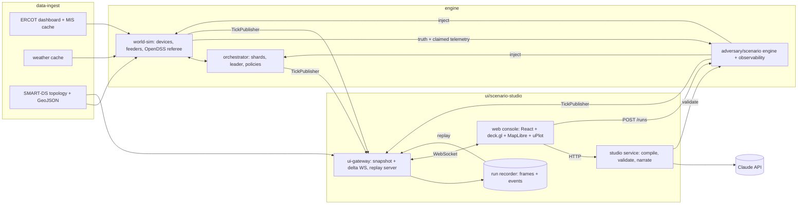

# ui/scenario-studio: round 1 design proposal

Component: **ui/scenario-studio**. It covers the operator console, the natural-language scenario studio, the UI gateway (websocket and replay server) and the 5-minute demo narrative. Sibling components: **world-sim**, **orchestrator**, **adversary/scenario engine + observability**, **data-ingest**. Facts come from `reports/Base Power system and ERCOT data.md` and the research notes. Any new fact has its URL next to it. Numbers marked *target* are goals to measure, not measured values.

---

## 1. Pitch

The console draws one gap that Base engineers work inside but rarely see on a screen: **the market sees one number per load zone, and physics sees every transformer.** Every view puts a base-point tracking line sitting inside ERCOT's tolerance band next to a map where 25 kVA transformers turn red because a price drop made hundreds of Cores charge at once. ERCOT's ADER rules say distribution limits "will not explicitly be enforced", so no market screen shows this.

Base engineers should find three things non-obvious:

1. **A hosting-capacity what-if** that produces a number nobody publishes. For a chosen feeder it answers: how many more Cores fit before the first transformer or voltage violation, under naive and under feeder-aware dispatch, and how many MW of market position feeder awareness gives up.
2. **A scenario studio where the LLM writes scenarios but never runs them.** A typed sentence compiles to a seeded, schema-validated scenario file addressed by its hash, and that file doubles as a regression test for a dispatch policy. The story is narrated from the *validated* scenario, not from the prompt, so it cannot promise behavior the engine will not produce.
3. **An operator-view / ground-truth toggle.** The adversary engine knows which batteries are compromised; the detectors only have beliefs. Showing both, with live hit, miss and false-alarm counts and time-to-detect, makes the security story checkable instead of theatrical.

Nothing on screen is scripted or interpolated. Every pixel encodes engine state, and state that is stale is drawn as stale.

---

## 2. Requirements

### Functional

| ID | Requirement |
|---|---|
| F1 | Map of the Austin-area grid: homes/batteries, service transformers, feeders, substations, power flows. Lenses: Mode, SoC, Voltage, Trust, Cohort (firmware or install batch). |
| F2 | Side panels: system frequency, load-zone price (LZ_AEN highlighted), feeder and transformer loading, MW committed vs delivered per principal, members with power, detections, time-to-detect (TTD), quarantined MW. |
| F3 | Time controls: play, pause, speed (1×/10×/60×/600×), scrub, step, jump to next event, LIVE vs REPLAY. |
| F4 | Drill-down: fleet → principal/partition → substation → feeder → transformer → device, with breadcrumbs. Each level shows its own KPIs against its own limits. |
| F5 | Incident timeline: exogenous events, detector firings, mitigations, orchestrator decisions and component failures. Clicking an entry seeks to it; entries are causally linked. |
| F6 | Control-plane panel: health of the orchestrator's own pieces (shards, leader and epoch, heartbeats, bus lag, detectors), with failure-injection buttons. |
| F7 | A/B mode: naive vs feeder-aware on the same scenario and seed, with clocks and cameras synced. |
| F8 | Hosting-capacity what-if: feeder, device class, placement and policy in; out comes a violation-vs-count curve plus a map of which transformers fail first. |
| F9 | Scenario studio: type → compile → preview (parameters, assumptions, clamps, sources, briefing) → run. Includes a library of pre-built buttons that works with no LLM. |
| F10 | ELI5 layer: plain-language tooltips and captions added *alongside* the engineering units, never replacing them. |
| F11 | Provenance: every data series carries a source chip (report ID, window, license). The credits panel lists every dataset. |
| F12 | Export: scenario JSON, run report (metrics and assertions), CSV of KPI series. |

### Non-functional (all *targets*, measured on the demo laptop with an on-screen counter)

| Area | Target |
|---|---|
| Frame rate | 60 fps pan/zoom at 17,000 homes; ≥30 fps at 100,000 with level-of-detail (LOD). deck.gl's own guide says about 1M items render at 60 fps on a 2015 MacBook Pro ([deck.gl performance](https://deck.gl/docs/developer-guide/performance)), so the risk is our update path, not the GPU. |
| Latency | Sim tick to pixels ≤250 ms in LIVE mode; input response <100 ms; library scenario start <1 s. |
| LLM | First visible progress <1 s (staged status); compile gives up at 20 s and falls back. The LLM is never on the run path. |
| Accessibility | Okabe–Ito colorblind-safe categorical palette ([Okabe & Ito](https://jfly.uni-koeln.de/color/)). Color is never the only cue (shape, dash, glyph), per WCAG 2.2 "Use of Color" ([WCAG 2.2](https://www.w3.org/TR/WCAG22/#use-of-color)). Keyboard time controls; `prefers-reduced-motion` replaces particles with static arrows; 1080p-legible type (≥14 px body, ≥20 px KPIs), because judges watch a video. |
| Offline | The demo runs with no internet: cached ERCOT/weather data, a local basemap (or schematic mode), library scenarios and recorded runs. The LLM is optional. |
| Determinism | A replay of a recorded run is frame-identical to the live run. The same scenario hash, seed and commit give the same metrics. |
| Secrets | No API key in the browser, the repo or the logs (§4.3). |

---

## 3. Architecture

### 3.1 Whole system, seen from the UI



Two key decisions:

- **Live and replay share one protocol.** The recorder stores exactly what the gateway sends; REPLAY is the gateway reading a file instead of the bus. The recording fallback (§9) comes free, and a judge can run the demo from the repo with no engine.
- **Engine components never touch websockets.** Each calls `TickPublisher.publish(tick)` with numpy arrays and event dicts; the gateway owns serialization, coalescing, LOD and backpressure.

### 3.2 Screens

1. **Operator console** (main screen, §3.3), with A/B split as a mode of it.
2. **Scenario studio**: a bottom drawer on the console, so the map stays visible while authoring.
3. **Hosting-capacity what-if**: a right-panel mode, selected by picking a feeder and choosing "What-if".
4. **Run report**: metrics, assertions (pass/fail) and an A/B diff, exportable.
5. **Data and credits**: every source, license and retrieval date.

### 3.3 Main screen wireframe

```
┌─────────────────────────────────────────────────────────────────────────────────────────────┐
│ Fleet ▸ AE sub-fleet (LZ_AEN) ▸ Sub p1uhs19 ▸ Feeder p1udt17263 ▸ Xfmr t_0412     [ELI5 ◐] [?] │
│ Scenario: "Evening price drop, 35% Cores" #a41f…  seed 42   ●LIVE ○REPLAY   View:[Operator|Truth]│
│ Policy: [Naive] [Feeder-aware] [A/B split]         ERCOT now: 59.998 Hz · PRC 10,4xx MW · src ⓘ  │
├──────────────────────────────────────────────────────────┬──────────────────────────────────┤
│                                                          │ SYSTEM                           │
│   MAP  (MapLibre basemap + deck.gl layers)               │ Frequency 59.9971 Hz  [mHz inset]│
│    ● homes: fill = mode, ring = SoC (street zoom)        │  ─ 59.85 FFR ─ 59.3 UFLS ─        │
│    ■ transformers: loading %, heat at fleet zoom         │ LZ_AEN $31.80/MWh  ▁▁▃▇ (15-min) │
│    ═ feeders: width = MW, color = loading,               │   src: ERCOT NP6-905-CD replay   │
│      particles = direction of real power flow            │ MARKET / PRINCIPALS              │
│    ⌂ substations        ⬡ quarantine hull                │ Commanded 6.2 MW  Delivered 5.9  │
│                                                          │ ▬▬ band max(2 MW,15%)  35/36 ok  │
│                                                          │ GRID (focus: feeder)             │
│                                                          │ Head 94%  Xfmr>100%: 7  V ok 99.2%│
│   [legend]  [lens: Mode|SoC|V|Trust|Cohort]  [minimap]   │ MEMBERS 1,012 powered · 0 unserved│
│                                                          │   below 20% reserve: 0           │
├──────────────────────────────────────────────────────────┤ SECURITY  detections 1 · TTD 38 s│
│ CONTROL PLANE  shard-01 ✓  shard-02 ✓  shard-03 ★L e7 ✓  │   quarantined 212 dev / 4.2 MW   │
│  shard-04 ✗ (hb 9.2 s)   bus lag 35 ms   detectors ✓✓✓   │   truth: hit 212 · miss 0 · FA 3 │
├──────────────────────────────────────────────────────────┴──────────────────────────────────┤
│ ◀◀ ▶ ▮▮ ▶▶  1× 10× 60× 600×  ⏭ next event  |━━━━━━━━━●━━━━━━━━━━━━━━━━|  20:55:10 CDT 2026-07-22│
│ ▲ price drop 20:45 ─ ◆ xfmr>100% 20:47 ─ ◆ residual detector 20:48 ─ ■ quarantine ─ ● re-dispatch│
├─────────────────────────────────────────────────────────────────────────────────────────────┤
│ STUDIO ▸ [ Describe a scenario…                                        ] [Compile] [Run ▶]   │
│ Library: [Price-drop rebound] [Heat-wave evening] [Uri replay] [1,000-battery hijack] [+8]   │
└─────────────────────────────────────────────────────────────────────────────────────────────┘
```

### 3.4 Data flow

1. **Connect.** `GET /api/topology` returns static binary arrays: positions, IDs, transformer and feeder membership, paths. The websocket then sends `hello`; the client sends `subscribe` (viewport, LOD, focus, view); the gateway answers with a keyframe `frame`, then deltas.
2. **Run.** The studio or library produces a scenario hash. `POST /api/runs` starts the run on the engine, and the gateway streams it. The recorder writes the frames. When the run ends, the report is computed from the recorded series.
3. **Seek or scrub.** `control:seek` makes the gateway send the nearest recorded keyframe plus deltas up to the target time. In LIVE mode, seeking backwards switches to REPLAY of the run so far.
4. **Drill-down** is client-side selection plus a `subscribe` update. The gateway narrows device detail to that feeder or transformer and adds the level's KPIs.

---

## 4. Key designs

### 4.1 Scenario-studio flow (pseudocode)

```
compile(text, ui_ctx):
  hit = library_match(text)                        # alias/keyword table; no network
  if hit.score >= HIGH: return preview(hit.scenario, hit.briefing, source="library")
  if not llm_available(): return suggest(library_top3(text), reason="LLM offline")

  stage("drafting")                                 # streamed to UI via SSE
  draft = claude.parse(model="claude-sonnet-5",
                       system=FROZEN_PREFIX,        # cache_control: rules, catalog, inventory, few-shots
                       user=wrap_untrusted(text) + ui_ctx_summary,
                       output_format=ScenarioDraft, # JSON Schema exported from engine's models
                       thinking=adaptive, effort=medium, timeout=20s, max_retries=1)
  if draft.stop_reason in {"refusal", "max_tokens"} or draft.status == "out_of_scope":
      return out_of_scope_card(draft.reason, library_top3(text))

  for attempt in 0..2:                              # validation and repair loop
      stage("validating")
      v = engine.validate(draft.scenario)           # SAME validator used by library + CI
      if v.ok or attempt == 2: break
      stage("repairing")
      draft.scenario = claude.parse(model="claude-haiku-4-5-20251001",
                                    system=REPAIR_PROMPT,
                                    user={scenario: draft.scenario, errors: v.errors},
                                    output_format=ScenarioDSL, timeout=8s)
  if not v.ok:
      c = clamp_numeric(draft.scenario, v.errors)   # deterministic; only range errors
      if engine.validate(c).ok: draft.scenario = c; draft.clamps += v.errors.as_clamps()
      else: return error_card(plain_language(v.errors), library_top3(text))

  scenario = v.normalized                           # defaults filled, canonical JSON
  h = sha256(canonical(scenario)); save("scenarios/user/"+h+".json", scenario + provenance)
  stage("narrating")
  b = narrate(scenario, CATALOG)                    # claude-haiku-4-5-20251001, streamed text
  if b.failed or not numbers_trace(b, scenario, CATALOG): b = template_briefing(scenario)
  return preview(scenario, b, clamps, assumptions, anchors, source="studio", hash=h)
```

Design choices:

- **Library first, offline first.** Library buttons and a keyword matcher answer the common phrasings ("Uri", "heat wave", "hijack", "contractor") instantly, with no network.
- **One structured output, not tools.** `output_config.format` guarantees parseable JSON on both Sonnet 5 and Haiku 4.5, and avoids forced `tool_choice`, which Opus 5.5 rejects with a 400 ([structured outputs](https://platform.claude.com/docs/en/build-with-claude/structured-outputs)).
- **Schema enforcement is not bounds enforcement.** The API does not enforce `minimum`/`maximum`; the Python and TypeScript SDKs strip them and check client-side. So caps and physical plausibility are enforced by **our** validator (owned by the adversary/scenario engine, shared with the library and CI). The model is never trusted on numbers.
- **Bounded repair.** Errors go back as `{path (JSON pointer), code, message, allowed}`, with at most two Haiku repairs. Then a deterministic clamp on range errors only, shown to the user ("You asked for 1,000,000 batteries; this grid has 1,366; clamped").
- **Narrate what will run, not what was asked.** The briefing is generated from the validated scenario plus a catalog of cited facts. `numbers_trace` requires every number in the story to match a scenario field or a catalog fact (with its URL); otherwise the templated briefing is used.
- **The model surfaces ambiguity; the human resolves it.** No questions back. The model picks catalog defaults and lists them as `assumptions`, shown as editable chips (e.g. Style: [Mass swing] [Stealth drift] [Mass, then stealth]).
- **Escalation.** Opus 5.5 (`claude-opus-5-5`) only if Sonnet 5 fails validation twice on a multi-phase adversary scenario. It is documented as sharing Opus 5's feature set; confirm structured-output support at build time.

### 4.2 Prompt design

The frozen prefix is cached with `cache_control`; confirm hits via `usage.cache_read_input_tokens` ([prompt caching](https://platform.claude.com/docs/en/build-with-claude/prompt-caching)). It contains:

1. **Role.** "Compile a plain-language grid scenario into the Scenario DSL. You describe causes; the simulator computes effects. Never predict outcomes."
2. **Hard rules.** Only enum `kind`s and inventory IDs; units from field names (`_kw`, `_mw`, `_min`, `_pct`); America/Chicago times; `anchors` name catalog IDs only, never a URL. A request that is really for real-world intrusion technique returns `status: "out_of_scope"`: the DSL describes attack **effects** (setpoint override, telemetry spoof, comms drop), never exploit steps.
3. **Phrase defaults from the research.** "evening peak" → 2026-07-22 replay, 18:00–22:00 (net-load peak around 8 pm); "winter storm"/"Uri" → 2021-02-14 to 17; "an AI" → adaptive adversary; "contractor mis-installed batch N" → `install_batch_fault`; "hoard" → `member_tamper`.
4. **Catalog.** The 16 scenarios in `grid_physics…md` §10 with anchor facts and URLs, plus the 11-row shortlist.
5. **Inventory.** Feeders, homes, devices by class, cohorts (firmware, install batch) and cached data windows. Stable per topology version, so it stays in the cached prefix.
6. **Five few-shot pairs.** Price-drop rebound, Uri, a hijack with a clamp, a contractor batch, one out-of-scope request.

User text goes inside `<scenario_request>` delimiters, marked as a description, not instructions. The LLM has no tools and no side effects; a human presses **Run**.

### 4.3 Guardrails and caps

Caps are **derived from data, not enumerated**, where possible.

| Field class | Rule |
|---|---|
| Device counts | ≤ devices that exist in the target selection. If the request exceeds them, the draft may raise `penetration` as an *assumption*, and that is shown to the user. |
| Per-device power | ≤ class rating: Core ±20 kW, legacy ±11.4 kW. SoC stays within 0–100%, with the 20% floor applied by the engine and never by a scenario. |
| Synthetic price overrides | Within the observed historical range of that settlement point in the cached 2010–2026 archive. Historical replays play recorded prices unmodified ($9,794.02/MWh at LZ_AEN on 2021-02-15 is allowed because it happened). |
| Weather | Within the cached record's observed Austin range, ±10 °F (ASSUMPTION). |
| Generator trip MW | ≤ the frequency model's validated range, which world-sim declares. |
| Outputs | **Forbidden.** No field may set frequency, voltage, loading, detection time or outcome. This rule is enforced by the schema itself. |
| Time | Must fall inside a cached data window. Duration is capped by world-sim's declared budget. |

**Key handling.** `ANTHROPIC_API_KEY` is read only by the studio service from its environment; `.env` is git-ignored and `.env.example` holds a placeholder; a pre-commit secret scan runs (e.g. [gitleaks](https://github.com/gitleaks/gitleaks)). The browser never calls Anthropic. Logs record model ID, request ID, token usage, latency and `stop_reason`, never headers, environment or the key. Saved scenarios record the model and a prompt hash.

### 4.4 Scenario library (works with no LLM)

Every button is a checked-in DSL file with its anchor and URL. Each file carries `assertions`, so CI can re-run the whole library as policy regression tests.

1. **Price-drop charging rebound** (the headline; answers the Base engineer's feeder question).
2. **Heat-wave evening, 2026-07-22.**
3. **Uri replay**: storm hold, then a rotating feeder outage, then restoration recharge with or without staggering.
4. **N-2 generator trip**: 2,750 MW.
5. **Feeder outage and restoration.**
6. **Comms flapping**: 20% of the fleet, sPower pattern.
7. **1,000-battery hijack**: mass swing.
8. **Adaptive attacker**: mass swing, then stealth drift.
9. **Contractor mis-installed batch 7**: CT polarity reversed, so claimed power has the wrong sign (Odessa-in-miniature pattern).
10. **Member hoarding.**
11. **Conflicting principals**: an Austin Energy peak-shave call against the 20% floor.
12. **Orchestrator chaos**: kill the shard leader, partition the bus, slow a worker. This tests the orchestrator's own pieces failing.

### 4.5 Visual encodings

| Element | deck.gl layer | Encoding |
|---|---|---|
| Home/battery | `ScatterplotLayer` (binary attributes) | Fill = mode, using Okabe–Ito colors: charging blue `#0072B2`, discharging orange `#E69F00`, idle grey, storm-hold reddish-purple `#CC79A7`, backup-islanded bluish-green `#009E73` ring, comms-lost/stale >180 s hollow with a dashed outline, fault/disabled black. Quarantined = vermilion `#D55E00` outline plus ✕ glyph. At street zoom, radius ∝ √|kW| and an outer ring arc shows SoC. |
| SoC lens | same layer | Sequential single-hue scale, 0–100%. The 20% floor is marked in the legend, and homes below the floor get a ▼ glyph. |
| Voltage lens | same layer | Diverging around 1.00 pu. Outside 0.95–1.05 pu (114–126 V) gets a ▲/▼ glyph, so the cue is shape as well as color. |
| Transformer | `ScatterplotLayer` (square) → `HeatmapLayer` at fleet zoom | Loading: <80% neutral, 80–100% yellow `#F0E442`, 100–120% orange, >120% vermilion. Outline thickness = minutes spent above 100% (thermal memory). The heatmap is weighted by kVA over rating. |
| Feeder | `PathLayer` + `TripsLayer` particles | Width ∝ |MW|; color = head loading (same scale). Particles move in the direction of real power, at a speed ∝ MW. **Reverse flow toward the substation uses sky-blue `#56B4E9` particles**, because protection engineers care about it ([TripsLayer](https://deck.gl/docs/api-reference/geo-layers/trips-layer)). |
| Substation | `IconLayer` | Ring = worst feeder under it. |
| Incidents | `PolygonLayer` / `ScatterplotLayer` | A detector halo pulses **once** (2 s) and then stays static. Quarantine = hatched vermilion hull labelled with blast radius (MW, homes). |
| Frequency chart | uPlot | 60 Hz centre line, IEEE 1547 ±0.036 Hz deadband band, and lines at 59.85 (FFR) and 59.3/58.9/58.5 (UFLS). A **mHz inset** makes a 3–5 mHz hijack visible while showing that it is tiny. |
| Tracking chart | uPlot | Commanded (5-min steps) vs delivered (2-s), with a shaded max(2 MW, 15%) band and an "intervals in tolerance" counter. |
| Members chart | uPlot stacked area | Grid-served / battery-backup / unserved. |

Motion rule: **only power flow moves.** Alarms pulse once. Nothing is tweened between engine frames. With reduced motion enabled, particles become static arrowheads.

### 4.6 ELI5 layer

The engineering label always stays visible. ELI5 adds a tooltip line and an optional caption strip. Captions are **templated from event kinds**, not generated by the LLM at run time, so they are deterministic and work offline.

| Term | Engineer label | ELI5 copy |
|---|---|---|
| Frequency | `59.9971 Hz` | "The grid's heartbeat, the same everywhere in Texas. Too little power and it slows. This whole attack moved it about 0.004 Hz: one rider easing off on a bicycle the whole state is pedalling." |
| Feeder | `p1udt17263 · 94% of rating` | "One neighbourhood circuit leaving the substation, like a water main for a few streets. This one serves 1,012 homes and peaks near 7 MW." |
| Service transformer | `t_0412 · 118% · 25 kVA` | "The can on the pole or the green box on the lawn that turns 7,200 V into your 240 V. Two or three homes share it. One Base Core charging flat out uses about 80% of a small one by itself." |
| Base point | `commanded 6.2 MW` | "The instruction every 5 minutes: 'deliver 6.2 MW now.' Land within 2 MW (or 15%) and you're on target." |
| SoC reserve | `SoC 64% · floor 20%` | "How full the battery is. Base always keeps at least 20% so the house has backup if the lights go out." |
| LZ_AEN | `LZ_AEN $31.80/MWh` | "ERCOT prices power by region. Austin Energy's region is LZ_AEN. There is no 'LZ_AUSTIN'." |
| Hosting capacity | `first violation @ N=…` | "How many more batteries this street's wires can take before something overheats or the voltage goes out of range." |
| Detection | `residual +3.1 MW > 0.6 MW` | "The meter at the top of the street disagrees with what 212 batteries claim they're doing, so we stopped trusting them and asked their neighbours to cover." |

The frequency figure in the first row is DERIVED from the research's 3–5 mHz estimate. The live caption reads the engine's value instead.

### 4.7 Front-end performance

- **Typed arrays end to end.** Topology arrives once as binary buffers. Per-tick state is struct-of-arrays passed to deck.gl as `data: {length, attributes: {...}}` with `updateTriggers` keyed on frame `seq`, as deck.gl recommends ("supply attributes directly", [performance](https://deck.gl/docs/developer-guide/performance)).
- **Decode in a Web Worker.** The worker parses frames, maps mode/SoC to an RGBA `Uint8Array` via a lookup table, and *transfers* buffers zero-copy. The main thread never builds per-device objects.
- **≤5 Hz map updates, latest wins.** Particles animate on the GPU via `currentTime`, independent of data rate.
- **Server-side LOD.** Fleet zoom gets transformer/feeder aggregates plus heatmap weights; per-device frames only for the viewport plus margin at street zoom (thresholds tunable).
- **Quantised frames.** kW ×100 `i16`, SoC ×2 `u8`, mode `u8`, flags `u8`, voltage ×10⁴ pu `u16`: about 7 bytes per device, so a keyframe is ~119 KB at 17,000 homes and ~700 KB at 100,000 (DERIVED); deltas are smaller.
- **uPlot for series.** Its README claims 166,650 points in 25 ms and 60 fps streaming ([uPlot](https://github.com/leeoniya/uPlot)). Long ranges are downsampled server-side with M4 (min/max/first/last per pixel column), which keeps spikes ([Jugel et al., VLDB 2014](https://www.vldb.org/pvldb/vol7/p797-jugel.pdf)).
- **Governor.** fps <30 for 3 s → drop particles, then aggregate LOD, with a "Performance mode" badge.
- **Map integration.** `MapLibreOverlay` from `@deck.gl/maplibre`, interleaved mode (needs WebGL2) ([deck.gl + MapLibre](https://deck.gl/docs/developer-guide/base-maps/using-with-maplibre)).

---

## 5. Interfaces and contracts

Conventions: units live in field names. Times are ISO-8601 with offset in JSON and float64 epoch-ms in binary. Display is in America/Chicago. Every server message carries `seq` (per run, monotonic) and `run_id`. The values below are illustrative.

### 5.1 HTTP

| Method and path | Purpose |
|---|---|
| `GET /api/topology?version=` | Static binary buffers plus a JSON index: ids, lon/lat, parents, ratings (kVA, MW), feeder paths |
| `GET /api/scenarios/library` | Library entries (DSL plus button label, ELI5 text, anchors) |
| `POST /api/studio/compile` → SSE | Events: `stage`, `draft`, `validation`, `briefing_delta`, `done{scenario_hash}` |
| `POST /api/scenarios/validate` | Proxied to the scenario engine (§5.4) |
| `POST /api/runs` | `{scenario_hash, policy: "naive"｜"feeder_aware"｜"ab", seed, speed, record: true}` → `{run_id, ws_url}` |
| `POST /api/whatif/hosting` | `{feeder_id, device_class, placement, policies, step, max_n, seeds}` → `{job_id}`; progress arrives over the websocket |
| `GET /api/runs/{id}/report` | Metrics, assertions, A/B diff |
| `GET /api/provenance` | Every series source, license and retrieval time |

### 5.2 WebSocket messages

| Direction | Type | Cadence |
|---|---|---|
| S→C | `hello` | On connect |
| C→S | `subscribe` | On connect, and on viewport/LOD/focus/view change (debounced 150 ms) |
| C→S | `control` | On user action |
| S→C | `frame` (binary) | Each engine tick, coalesced to ≤`max_fps` (default 5) per client. A keyframe every 10 s wall time, on subscribe, and on seek |
| S→C | `kpi` | 2 Hz wall time, stamped with sim time |
| S→C | `series_burst` | On demand: high-resolution windows (e.g. 100 ms frequency for 60 s after a trip) |
| S→C | `event` | As they occur; **never coalesced or dropped** |
| S→C | `control_plane` | 1 Hz |
| S→C | `run_status`, `heartbeat` | On change / 1 Hz |
| C→S | `ack {seq}` | After each applied frame (backpressure) |

```json
{"type":"hello","protocol":"bfs-ws/1","run_id":"r_7f3a","mode":"live","topology_version":"smartds-p1u-p1uhs19-v1",
 "sim_time":"2026-07-22T18:00:00-05:00","tick_ms":2000,"speed":10,"views":["operator","truth"]}

{"type":"subscribe","view":"operator","bbox":[-97.78,30.36,-97.66,30.46],"zoom":14.2,"lod":"device",
 "focus":{"level":"feeder","id":"p1udt17263"},"lenses":["mode"],"max_fps":5}

{"type":"control","action":"seek","sim_time":"2026-07-22T20:55:00-05:00"}   // play|pause|speed|step|next_event

{"type":"kpi","seq":18423,"sim_time":"2026-07-22T20:55:10-05:00",
 "freq_hz":59.9971,"freq_src":"model",
 "price":{"LZ_AEN":{"usd_per_mwh":31.8,"interval_end":"2026-07-22T21:00:00-05:00","src":"ercot:NP6-905-CD","replay":true}},
 "principals":[{"id":"ae_subfleet","kind":"utility","commanded_mw":6.2,"delivered_mw":5.9,"tolerance_mw":2.0,"intervals_ok":35,"intervals_total":36}],
 "grid":{"feeder_max_load_pct":94.1,"xfmr_over_100":7,"v_in_band_pct":99.2,"v_min_pu":0.941},
 "members":{"total":1012,"grid_served":1012,"backup_served":0,"unserved":0,"below_reserve":0},
 "security":{"detections_open":1,"quarantined_devices":212,"quarantined_mw":4.2,
             "truth":{"hit":212,"miss":0,"false_alarm":3,"ttd_s":38}}}   // "truth" only when view=truth

{"type":"event","seq":912,"sim_time":"2026-07-22T20:48:02-05:00","kind":"detector_fired",
 "source":"observability.feeder_residual","severity":"high",
 "summary":"Feeder-head residual +3.1 MW vs fleet claims","targets":{"feeder":"p1udt17263","device_count":212},
 "evidence":{"residual_mw":3.1,"threshold_mw":0.6},"links":{"caused_by":null,"mitigated_by":913}}

{"type":"control_plane","seq":18424,"sim_time":"2026-07-22T20:55:10-05:00",
 "shards":[{"id":"shard-03","role":"leader","epoch":7,"heartbeat_age_ms":420,"devices":168,"mw_cap":1.1,"cmd_seq":88121,"state":"ok"},
           {"id":"shard-04","role":"follower","epoch":6,"heartbeat_age_ms":9200,"state":"dead"}],
 "bus":{"lag_ms":35},"detectors":[{"id":"feeder_residual","state":"ok"}]}
```

Event `kind` enum, as the UI legend needs it: `exogenous` (price, weather, trip), `scenario_injected` (truth view only when the injection is adversarial), `threshold_crossed`, `detector_fired`, `mitigation_applied`, `orchestrator_decision` (with `reason_code`), `component_failed`, `component_recovered`, `leader_elected`, `run_marker`.

### 5.3 Binary frame layout

`[u32 header_len][header JSON][pad to 8][section blobs…]`. Example header:

```json
{"type":"frame","seq":18422,"keyframe":false,"base_seq":18400,"sim_ms":1784771710000,"lod":"device",
 "sections":[{"name":"device.idx","dtype":"u32","n":3121,"offset":0},
             {"name":"device.kw_x100","dtype":"i16","n":3121,"offset":12484},
             {"name":"device.soc_x2","dtype":"u8","n":3121,"offset":18728},
             {"name":"device.mode","dtype":"u8","n":3121,"offset":21856},
             {"name":"device.flags","dtype":"u8","n":3121,"offset":24984},
             {"name":"xfmr.load_pct_x10","dtype":"u16","n":379,"offset":28112},
             {"name":"feeder.p_kw","dtype":"f32","n":1,"offset":28872}]}
```

- Keyframes omit `idx`; their arrays are dense and ordered by topology index.
- `flags` bits: stale, quarantined, islanded, tamper-suspect, and `compromised_truth`. The last bit is sent **only** when `view=truth`, so operator view genuinely cannot see ground truth.
- If a delta's `base_seq` is missing, the client sends `{"type":"resync"}`.
- If the client's `ack` falls more than 3 frames behind, the gateway drops deltas and sends the next keyframe.

### 5.4 Studio → scenario engine contract

The adversary/scenario engine owns the DSL and the validator. The studio consumes:

- `GET /api/scenarios/schema`: JSON Schema exported from the engine's source-of-truth models. It must be **non-recursive**, with `additionalProperties:false` on every object, because structured outputs support neither recursive schemas nor other `additionalProperties` values ([structured outputs](https://platform.claude.com/docs/en/build-with-claude/structured-outputs)).
- `POST /api/scenarios/validate {scenario}` → `{ok, normalized, errors:[{path, code, message, allowed}], derived:{devices_in_target, est_swing_mw}}`

Example validation error:

```json
{"path":"/events/0/target/count","code":"exceeds_available","message":"1,000 devices requested; 612 in selection","allowed":{"max":612}}
```

The studio produces an envelope around the DSL. Field names inside `scenario` are illustrative until the engine designer fixes them.

```json
{"status":"ok",
 "interpretation":"Adaptive attacker hijacks 1,000 batteries on three feeders at the 2026-07-22 evening peak; goes quiet and drifts if detected.",
 "scenario":{
   "dsl_version":"0.1","id":"ai-takeover-1000-evening","seed":42,
   "window":{"start":"2026-07-22T18:00:00-05:00","duration_min":240,
             "replay":{"prices":"ercot:LZ_AEN:2026-07-22","weather":"open-meteo:austin:2026-07-22"}},
   "grid":{"topology":"smartds-p1u-p1uhs19-v1","feeders":["p1udt17263","<feeder2>","<feeder3>"],
           "penetration":{"homes_with_battery_pct":35,"class_mix":{"core_39_2":0.6,"legacy_25":0.4}}},
   "policy":"ab",
   "events":[{"at_min":60,"kind":"credential_compromise","target":{"select":"random","count":1000},"params":{"scope":"shard"}},
             {"at_min":61,"kind":"setpoint_override","target":{"select":"compromised"},"params":{"pattern":"full_swing","sync_s":1}}],
   "adversary":{"kind":"adaptive","objective":"mass_then_stealth","on_detection":"go_quiet_then_drift",
                "drift":{"soc_bias_pct":3,"delivery_ratio":0.8,"added_lag_s":2}},
   "assertions":[{"metric":"members.unserved","op":"==","value":0,"policy":"feeder_aware"},
                 {"metric":"members.below_reserve","op":"==","value":0}]},
 "assumptions":[{"path":"/scenario/grid/penetration/homes_with_battery_pct","value":35,
                 "reason":"1,000 devices need ≥35% penetration across three ~1,000-home feeders"}],
 "clamps":[],
 "anchors":["ukraine-2015","blackiot-2018","volt-typhoon-aa24-038a"],
 "watch":["grid.xfmr_over_100","freq_hz","security.truth.ttd_s"]}
```

The drift values (3% SoC bias, 80% delivery, 2 s added lag) are the stealth examples from the research. The assertions are cause-agnostic invariants (no unserved members, no reserve violations) rather than predicted numbers.

---

## 6. Failure handling

| Failure | Detection | Behaviour |
|---|---|---|
| Engine slower than the requested speed | Sim-clock rate vs wall-clock rate | Badge "sim 42× (asked 60×)". The gateway lowers the effective speed; the UI **never interpolates** physics values. |
| Stale panel | `kpi` age >2 s wall time | The panel greys out and shows "as of 20:55:10". This mirrors the device-level 180 s stale rule. |
| Dropped websocket | Heartbeat missed for 3 s | Banner "Reconnecting, data frozen at t". Exponential backoff with jitter; resume with `last_seq`. The gateway replays from its ring buffer or sends a keyframe. |
| Engine crash | `run_status: aborted` | The recorder keeps frames up to the crash, and the report is marked incomplete. **Orchestrator failures are data** (control-plane panel), not UI errors. |
| LLM down | Connection error, 5xx or 429 after the SDK retry | "Authoring offline." The library top 3 by keyword match plus the schema form keep studio usable; nothing else changes. |
| LLM slow | 20 s compile budget (SDK timeout set explicitly; the default is 10 min) | Cancel, then offer the closest library scenario. The staged SSE shows where it stopped. |
| LLM invalid | Validator errors after two repairs | Deterministic clamp, or a plain-language error card. The invalid draft is kept for debugging. |
| LLM refusal / `max_tokens` | `stop_reason` | Neutral "can't compile that" card with library suggestions. For `max_tokens`, retry once with a higher cap. |
| Hallucinated number in the briefing | `numbers_trace` fails | Replace with the templated briefing. |
| Huge point counts | Topology size, fps governor | Server LOD aggregates, particles off, then heatmap only. At ≥100,000 devices, per-device frames only for the viewport. |
| Basemap unreachable | Tile errors | Local PMTiles extract of Austin ([pmtiles extract --bbox](https://docs.protomaps.com/pmtiles/cli)), or **schematic mode** with no basemap, where feeder paths outline the streets. |
| Out-of-order or duplicate frames | `seq` | Drop anything older than what has been applied. |

---

## 7. Stack

| | **A: React + Vite + TypeScript + deck.gl 9.4 + MapLibre 6 + uPlot + Zustand** | **B: SvelteKit + deck.gl (imperative) + MapLibre** |
|---|---|---|
| deck.gl integration | First-class `@deck.gl/react`; `MapLibreOverlay` documented | Imperative `Deck` instance; wiring and lifecycle are hand-written |
| Hot-path performance | Same: both bypass the framework for the binary-attribute path | Same |
| Team and AI-assist familiarity | Highest: most examples and fewest surprises for a front-end helper new to power | Lower; fewer deck.gl examples |
| Boilerplate | More | Less |

**Recommendation: A.** In 48 hours the risk is integration surprises, not framework overhead, and the hot path (Worker → typed arrays → deck.gl) is framework-independent. Versions as the research verified: `maplibre-gl` 6.11.2, `deck.gl` 9.4.0. The **ui-gateway and studio service run in Python (FastAPI + websockets)** with the `anthropic` SDK, the same language as world-sim (OpenDSSDirect.py), so there is no second backend runtime.

---

## 8. Build order by dependency

```
[C0 contracts: WS/HTTP spec + DSL JSON Schema]
      ├─> [C1 mock frame generator on SMART-DS topology] ─> [U1 static map] ─> [U2 live colors + time controls + KPI panels]
      ├─> [G1 gateway + TickPublisher] ─> [G2 recorder + REPLAY] ─────────────┘
      └─> [S1 validator (scenario engine)] ─> [S2 library buttons → POST /runs] ─> [S3 LLM compile + repair + clamp] ─> [S4 briefing + numbers_trace]
U2 ─> [U3 incident timeline] ─> [U4 control-plane panel] ─> [U5 A/B split] ─> [U6 hosting what-if (needs world-sim sweep)]
U2 ─> [U7 drill-down + device inspector] ;  U2 ─> [U8 ELI5 tooltips] ;  G2 ─> [D1 one-command offline demo]
```

| Item | Depends on | Class |
|---|---|---|
| C0 contracts (this §5, agreed by all five) | nothing | ESSENTIAL |
| C1 mock frame generator (unblocks UI before the engine exists) | C0, SMART-DS topology | ESSENTIAL |
| G1 gateway + TickPublisher, snapshot/delta, backpressure | C0 | ESSENTIAL |
| G2 run recorder + REPLAY via the same protocol | G1 | ESSENTIAL |
| U1 static map: homes, transformers, feeders, substations; schematic fallback | C0 | ESSENTIAL |
| U2 live mode/SoC/loading colors; play/pause/speed/seek; KPI panels (frequency, LZ_AEN, tracking, members) | U1, G1 | ESSENTIAL |
| U3 incident timeline with seek | U2 | ESSENTIAL |
| U4 control-plane panel + failure-injection buttons | U2, orchestrator health feed | ESSENTIAL |
| U5 A/B naive vs feeder-aware | U2, orchestrator policy switch | ESSENTIAL |
| U6 hosting-capacity what-if curve + transformer fragility map | U2, world-sim sweep API | ESSENTIAL |
| S1 validator endpoint | adversary engine DSL | ESSENTIAL |
| S2 library buttons | S1, G1 | ESSENTIAL |
| S3 LLM compile + repair + clamp + preview card | S1, S2 | ESSENTIAL (the scenario creator the team agreed on) |
| S4 LLM briefing + numbers trace (template briefing is the ESSENTIAL floor) | S3 | ENHANCEMENT |
| U7 drill-down breadcrumbs + device inspector | U2 | ESSENTIAL (inspector) / ENHANCEMENT (breadcrumbs) |
| U8 ELI5 tooltips | U2 | ESSENTIAL; caption strip ENHANCEMENT |
| Provenance chips + credits panel | data-ingest metadata | ESSENTIAL |
| Operator/Truth toggle + confusion counts | U2, observability truth feed | ESSENTIAL |
| D1 `make demo-replay`: offline demo from a recorded run | G2 | ESSENTIAL |
| TripsLayer particles; fleet-zoom heatmap | U2 | ENHANCEMENT |
| 100k LOD + performance governor (17k without LOD is ESSENTIAL) | U2, G1 | ENHANCEMENT |
| Live ERCOT ribbon (real frequency, PRC, price from dashboards) | data-ingest | ENHANCEMENT |
| Full schema-driven scenario editor form | S1 | ENHANCEMENT |
| Library-as-CI regression job + run report export | S2, G2 | ENHANCEMENT |
| Local PMTiles basemap | none | ENHANCEMENT |

---

## 9. Scoring by judging line, with storyboard

| Rubric line | How this component earns it |
|---|---|
| Completeness (15) | One continuous take: type a scenario, compile, validate, run, detect, contain, report, with no cuts in the core loop. `make demo-replay` lets a judge run the same thing from the repo. |
| Technical depth (15) | Snapshot/delta binary protocol with backpressure; a validated LLM compiler with a repair loop; a live control plane showing the orchestrator failing over. |
| Problem (15) | Orchestration: the video shows the orchestrator's **own** pieces failing, plus fleet failures. Open Grid Data: ERCOT LZ_AEN replays with source chips. |
| The "why" (15) | Market view vs physics view on one screen; the ADER "not enforced" line; the Base engineer's feeder question answered with a number. |
| Insight (10) | The hosting-capacity number (naive vs feeder-aware). A 1,000-battery hijack is a neighbourhood emergency (feeders red) and a Texas non-event (mHz inset). |
| Usability (10) | The what-if for Deployments; the scenario library as regression tests for Markets; ELI5 for non-experts. |
| Creativity (10) | A natural-language studio grounded in physics validation; the truth-vs-operator toggle; reverse-flow particles. |
| Performance (10) | On-screen fps, bytes per frame, OpenDSS ms per solve and sim steps per second, at 17k and then 100k. |

### Storyboard (5:00)

| Time | On screen | Voiceover beat | Rubric |
|---|---|---|---|
| 0:00–0:15 | Replay of 2026-07-22, north-Austin feeder. The LZ_AEN price drops (the time comes from the data); Cores start charging together; transformers turn red one by one. | "ERCOT sees this fleet as one number. The street sees 379 transformers." | Insight, Why |
| 0:15–0:40 | A/B split: tracking line green inside its band on the left, feeder map red on the right. The ADER line appears as a caption with its source. | ERCOT dispatches by load zone and does not enforce distribution limits; Base is hiring for exactly this. Honest grid label: SMART-DS synthetic feeder, AE sub-fleet at LZ_AEN. | Problem, Why |
| 0:40–1:05 | Pipeline strip with live counters: ERCOT cache → world-sim (OpenDSS ms/solve) → orchestrator shards → detectors → UI. | What is real: data sources, physics referee, balancing logic. | Depth, Performance |
| 1:05–1:50 | Select feeder p1udt17263 → What-if → add Cores. The curve draws, with first-violation markers for naive vs feeder-aware and MW given up; the transformer fragility map lights up. | "The number nobody publishes: how many Cores this feeder can host, and what it costs to stay safe." | Insight, Usability, Open Grid Data |
| 1:50–2:35 | Heat-wave run. Click **kill shard leader**: the shard tile goes ✗, followers show a new epoch, stale devices go hollow and neighbours re-dispatch. The tracking line dips and recovers; the in-tolerance counter shows the honest result. Then 20% comms flapping. | "How it holds up when *our* pieces fail": what failed, what took over, time to rebalance. | Orchestration problem, Completeness |
| 2:35–3:35 | Studio: type "an AI takes over 1,000 batteries during the evening peak and fights back". Staged compile; preview shows parameters, the penetration assumption, anchors and a two-line ELI5; press Run. Mass swing: feeders red, frequency mHz inset. Detector fires (TTD shown), quarantine hull appears, re-dispatch. The attacker goes quiet, then drifts. At 600×, the peer-drift detector catches it. Truth toggle shows hit/miss/false-alarm counts. | Blast radius per credential; physics beats command logs; the LLM only wrote the scenario and the validator checked it. | Creativity, Insight, Depth |
| 3:35–4:10 | Uri replay: the price panel shows $9,794.02/MWh at LZ_AEN on 2021-02-15 with its ERCOT source chip. Storm hold, then a rotated feeder, then restoration: staggered vs naive recharge peak. | Real ERCOT data drives the run; members kept powered. | Open Grid Data, Problem |
| 4:10–4:35 | Zoom out to 17k homes, then 100k (replicated feeders, labelled synthetic). fps, bytes per frame and solve-time counters stay visible. | Scale numbers stated plainly. | Performance |
| 4:35–4:50 | Terminal: CI runs the library as regression tests (pass/fail); export a feeder hosting report. | "What Base could open tomorrow." | Usability, Track 3 |
| 4:50–5:00 | Credits: ERCOT MIS/dashboards, NREL SMART-DS (CC BY 4.0), OpenFreeMap © OpenMapTiles, OSM, Open-Meteo; repo URL. | Sources and license. | Integrity |

**Fallback plan for recording.**
1. Record each beat live first, with a scenario hash, seed, policy and git commit per beat.
2. If a live component misbehaves, switch the console to **REPLAY** of that beat's recorded run. The UI is identical, and a corner badge reads "Replay of run r_… (recorded 10:32)". That is honest and deterministic.
3. The studio compile beat keeps a cached compile response for its exact prompt. If the API is slow, play the cached compile with a "cached compile" badge.
4. CI checks that replaying the recording matches a fresh re-run hash, so the fallback is the same system, not a mock-up.

### Track 3 (commercial) in one paragraph

Base already sells "distribution grid support" on targeted circuits, is hiring for controls at "distribution system voltages", and has its quants validate models "in a simulation environment" before production. This console is the tool those teams share. Deployments runs the hosting what-if before a homebuilder subdivision goes in and gets the list of transformers that break first. Markets runs the scenario library against a new dispatch policy as a regression gate, with Base's ML dispatcher plugged in as a black-box policy (signals in, setpoints out). Utility partnerships show Austin Energy or CoServ how many more MW of capacity-as-a-service a circuit can safely host. Each additional Core a feeder can host without a wires upgrade is capacity Base can sell.

---

## 10. Risks, unknowns and questions for Base engineers

**Risks**

- **Visual overload for non-experts.** One lens at a time, focus dimming, ELI5 captions.
- **"API wrapper" perception of the studio.** Show the validator rejecting and clamping on screen; the LLM is optional and off the run path.
- **Multi-scale time.** Sub-second frequency events and multi-day drift need `series_burst` windows and jump-to-event; both depend on world-sim cadence.
- **Protocol churn** between five builders. Freeze C0 early; the mock generator validates against the schema.
- **Browser limits at 100k** are unmeasured. Measure early; 17k is the essential target.
- **Grid labelling.** SMART-DS north Austin is really Austin Energy territory; every screen must say so.

**Questions for Base engineers**

1. During an event, what is the first number your Markets desk or on-call operator looks at? Which one would they want on this screen that isn't here?
2. Who would use a feeder hosting what-if: Deployments before installs, Markets, or utility partners? Do you have transformer-to-meter mapping to feed it?
3. What resolution do you review tracking at: 2-s telemetry or 5-min SCED intervals?
4. What assertions would make a scenario regression test credible to you?
5. Do operators use Grafana today? Would exporting run series in a Grafana-friendly form matter?
6. Your vocabulary: "partition" or "aggregation"? What do you call the device modes?
7. When a unit loses comms, does it hold its last set point or go idle? This decides the COMMS_LOST glyph and caption.

---

## 11. What the other designers need to get right

- **world-sim**
  - Stable IDs equal to SMART-DS names.
  - Per-tick numpy arrays in topology order through `TickPublisher`.
  - Separate **physics truth** from **claimed telemetry**, so the UI can draw the gap.
  - Declared tick cadence, plus `series_burst` high-resolution windows around events.
  - A hosting-capacity **sweep API** with seeds, policies and a per-transformer first-violation count.
  - Declared caps (maximum trip MW, maximum duration) for the validator.
  - Determinism given a seed.
- **orchestrator**
  - A decision log with `reason_code` and the triggering signal.
  - A control-plane health feed (shard, role, epoch, heartbeat age, command sequence, MW cap per shard) at 1 Hz.
  - A naive/feeder-aware policy switch that works on the same seed.
  - Commanded vs delivered per principal.
  - Failure-injection hooks for its own pieces.
  - Blast radius per credential or shard as a queryable number.
- **adversary/scenario engine + observability**
  - The DSL as the single source of truth, exported as a **non-recursive** JSON Schema with `additionalProperties:false`.
  - **Cause-only fields.**
  - Attack effects as enums (never techniques).
  - A `validate` endpoint returning JSON-pointer errors with `allowed` ranges, plus a `normalized` form.
  - Detector events with evidence and affected IDs.
  - Ground-truth compromise flags, published separately so the truth view can be toggled.
  - Agreed TTD and time-to-mitigate definitions.
  - Adaptive-attacker state changes as truth-only events.
- **data-ingest**
  - Provenance per series (source URL, report ID, window, license, `retrieved_at`).
  - Pre-cut replay windows (2026-07-22, Uri 2021-02-14 to 17, August 2023) with LZ_AEN.
  - The historical price and weather ranges the validator uses as caps.
  - Explicit Central Prevailing Time handling (hour-ending conventions, DST duplicates).
  - The Open Grid Data insight delivered as a series or chart spec the console can show with its source.
- **Everyone**
  - Units in field names.
  - ISO times with offset.
  - `seq` on every message.
  - No keys in code or logs.
  - Freeze the §5 contracts before building against them.
